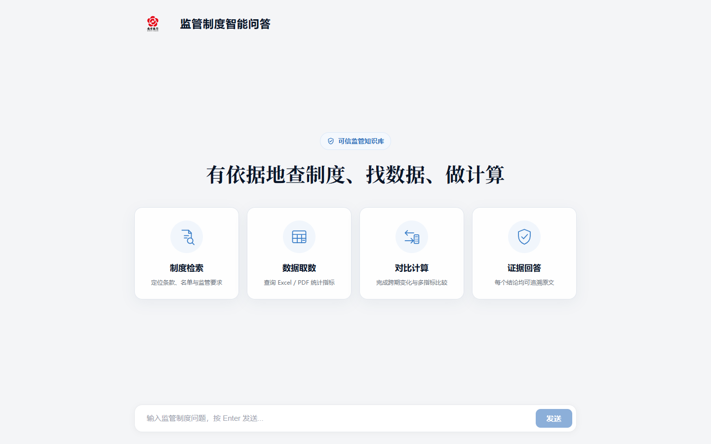
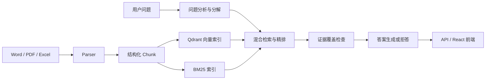

# 可信 RAG 银行业监管问答系统

面向银行业监管制度与统计报表的可信检索增强生成（RAG）问答系统，参赛项目为“第五届中国研究生金融科技创新大赛·南京银行赛题”。

系统将 Word、PDF、Excel 资料解析为带来源信息的结构化 Chunk，通过 BM25、向量检索、RRF 融合与交叉编码器精排定位证据，再生成附带原文引用的答案。项目也可以替换为使用者自己的制度、合规和统计资料，重新构建专属知识库。



## 当前具备的能力

- **多格式解析**：支持 `.docx`、`.pdf`、`.xls`、`.xlsx`；旧版 `.doc` 需要可用的 Word 转换环境，建议预先转换为 `.docx`。
- **按资料类型切块**：区分制度文件、报告、Excel 数据和 PDF 表格，保留标题层级、页码、行列口径、单位、单元格位置等元数据。
- **混合检索与精排**：组合 BM25 关键词检索、BGE 向量检索、RRF 融合和 CrossEncoder 精排，并支持按来源标题、章节和资料类型限定范围。
- **表格取数与计算**：根据指标、期间、单位和表格区块筛选结构化单元格；只有取得全部操作数后才执行确定性计算。
- **多目标问题分解**：识别跨文件、多事实、选项比较和季度计算问题；证据缺失时最多补搜一次。
- **有据回答与拒答**：答案附带原文证据；资料不足、超出知识库范围或缺少必要操作数时拒答或说明缺失信息。
- **连续对话**：问答接口接受历史消息，可解析“那一份”“上一季度”等上下文指代。
- **处理进度展示**：通过 SSE 展示“分析问题、检索资料、整理证据、生成答案”等阶段和已处理时间。
- **可复现评测**：选择题使用确定性规则判分，记录检索目标、候选数量、阶段耗时、覆盖状态和补搜次数，不使用 LLM Judge 代替正式判分。

## 系统流程



检索编排由项目自身的 Python 模块实现，未引入 LangChain 或 LangGraph。证据覆盖状态分为 `supported | not_supported | missing`，仅对 `missing` 的检索目标补搜一次。

## 使用自己的资料

本项目可以复用为相似的制度、合规和统计资料问答系统。当前版本采用“文件目录 + Manifest + 命令行建库”的方式，不是网页上传后自动入库。

### 1. 放置资料

将资料放入 `data/raw/` 下，例如：

```text
data/raw/my_documents/
├─ 管理办法.docx
├─ 统计报告.pdf
└─ 季度数据.xlsx
```

### 2. 登记 Manifest

在 `data/manifest.json` 中为每份资料添加记录。`doc_id` 必须唯一，`local_path` 使用相对于项目根目录的路径：

```json
[
  {
    "doc_id": "CUSTOM-001",
    "title": "示例管理办法",
    "issuer": "示例机构",
    "doc_no": "",
    "publish_date": "2026-01-01",
    "source_url": "",
    "local_path": "data/raw/my_documents/示例管理办法.docx"
  }
]
```

### 3. 分类、切块并建立索引

```powershell
# 为没有 parse_profile 的记录判断解析类型
uv run --frozen python scripts/classify_manifest.py --dry-run
uv run --frozen python scripts/classify_manifest.py

# 解析全部 Manifest 资料并生成 Chunk JSONL
uv run --frozen python scripts/ingest.py

# 写入 Qdrant 并构建 BM25 索引
uv run --frozen python scripts/build_index.py
```

`scripts/ingest.py` 会重新生成两套 Chunk JSONL，适用于首次建库或确认进行全量重建的场景。已有知识库的单文档更新应使用带预览、备份和回滚的 `scripts/update_documents.py`，不要直接用全量解析替代线上增量更新。

银行业之外的资料可以复用解析、索引、检索和证据链路，但通常还需要调整问题分类规则、提示词、表格口径和评测题库。

## GitHub 仓库边界

为控制仓库体积，GitHub 源码不包含以下运行数据：

- 比赛原始资料 `data/raw/`；
- `.doc` 转换产物 `data/converted/`；
- 完整 Chunk JSONL、BM25 索引和 Qdrant 数据；
- Hugging Face Embedding 与 Reranker 模型缓存；
- 真实 API Key。

因此，公开仓库用于查看源码和使用自有资料重新建库，不是克隆后无需数据即可直接问答的在线 Demo。完整比赛交付包会另外包含运行数据、数据库快照、部署说明，以及“含模型版”和“无模型版”两种形式。

## 本地开发启动

### 1. 安装依赖

需要 Python 3.11、[uv](https://docs.astral.sh/uv/)、Node.js 和 Docker Desktop。

```powershell
uv sync --frozen
```

### 2. 配置环境变量

```powershell
Copy-Item .env.example .env
notepad .env
```

至少配置：

```dotenv
OPENAI_API_KEY=填写自己的API密钥
OPENAI_BASE_URL=填写对应的OpenAI兼容接口地址
LLM_MODEL=填写接口实际支持的模型名称
HF_HOME=填写HuggingFace模型缓存目录
```

首次下载 BGE 模型时设置 `HF_HUB_OFFLINE=0`；模型下载完成且缓存完整后可以设置为 `1`。不要提交填写后的 `.env`。

### 3. 启动 Qdrant

```powershell
docker compose up -d qdrant
```

首次使用需要先按照“使用自己的资料”完成解析和索引。

### 4. 启动后端

```powershell
uv run --frozen python -m uvicorn src.api.main:app --reload
```

后端地址：<http://localhost:8000>

### 5. 启动前端

```powershell
Set-Location src/frontend
npm ci
npm run dev
```

浏览器访问：<http://localhost:5173>

## 运行评测

```powershell
# 运行默认评测
uv run --frozen python scripts/run_eval.py

# 运行指定题目，并将结果写入独立目录
uv run --frozen python scripts/run_eval.py --ids Q035,Q068 --run-name smoke
```

使用 `--run-name` 时，进度和报告写入 `data/eval/runs/<run-name>/`。评测支持断点续传，单题异常不会中断整轮。

## 运行测试

```powershell
uv run --frozen python -m pytest tests/ -v
```

## 主要目录

```text
src/parser/       文档解析与结构化切块
src/indexer/      BGE Embedding、Qdrant 和 BM25
src/retriever/    查询路由、混合召回、RRF 与精排
src/generator/    问题分解、证据检查与答案生成
src/api/          FastAPI 与 SSE 接口
src/frontend/     React + Vite 前端
scripts/          建库、更新、评测和质量检查脚本
docs/             架构、比赛技术文档和操作指南
tests/            单元测试与回归测试
```

## 进一步阅读

- [技术文档](docs/competition/submission/技术文档.md)
- [系统设计](docs/architecture/design.md)
- [切块策略](docs/architecture/chunking-strategy.md)
- [Git 协作指南](docs/guides/git-guide.md)

## 当前限制

- 前端尚未提供文件上传与知识库管理页面。
- `POST /api/ingest` 目前只重新生成 Chunk JSONL，不会自动更新 Qdrant 和 BM25，因此不作为生产在线入库接口。
- 扫描版 PDF 尚未集成 OCR，需要先转换为可提取文本的文件。
- 健康检查接口只表示 API 进程可用，不代表 Qdrant、本地模型和外部 LLM 均已通过验证。
- GitHub 源码不附带比赛资料和完整索引，首次运行必须准备自己的资料或使用单独交付包。
