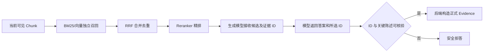

# ADR-003：独立通道混合检索与证据约束生成

- 状态：已采纳
- 日期：2026-08
- 关联 Issue：[#19](https://github.com/wxl-0/trusted-rag-banking/issues/19)、[#20](https://github.com/wxl-0/trusted-rag-banking/issues/20)、[#17](https://github.com/wxl-0/trusted-rag-banking/issues/17)、[#16](https://github.com/wxl-0/trusted-rag-banking/issues/16)

## 背景

银行监管问答同时包含两类知识：

- 制度条款需要匹配机构、文号、章节、业务术语和完整语义；
- 统计报表需要精确匹配期间、地区、指标、单位、工作表和单元格。

只使用 BM25 容易漏掉同义表达，只使用向量检索容易混淆年份、指标和相似表格。即使检索正确，如果允许生成模型自行填写证据正文，也可能出现“答案看似有引用但引用不来自本次资料”的问题。

早期实现还存在两个工程风险：

- 多个 Collection 的结果先拼接再融合，Collection 顺序会影响排名；
- 检索器共享可变 diagnostics，多目标并发时可能串用诊断。

## 决策问题

如何兼顾精确召回、语义召回、跨来源公平融合和最终证据可信，同时控制重复 Embedding 和多目标延迟？

## 候选方案

### 方案 A：只使用向量检索

语义能力较好，但对数字、文号、精确指标和来源标题不够稳定。

### 方案 B：只使用 BM25

精确词匹配强，但同义表达、自然语言改写和长句语义召回不足。

### 方案 C：向量 + BM25 混合检索，模型自由生成引用

召回能力提升，但模型仍可能引用候选集合之外的内容，证据链不封闭。

### 方案 D：独立通道混合检索 + 后端证据重建

制度向量、表格向量和对应关键词结果分别保留独立排名，以 RRF 公平融合并经 Reranker 精排；生成模型只返回候选证据 ID，后端构造正式 Evidence。

## 决策

采用方案 D：

1. 同一检索目标只生成一次查询向量，并复用于制度和表格 Collection；
2. 制度向量、表格向量及关键词结果作为独立排名通道；
3. 每个通道从 rank 1 开始参与 RRF，重复 Chunk 累加分数并去重；
4. 融合候选进入 CrossEncoder Reranker；
5. 来源标题、资料类型、章节、工作表和期间等元数据在可确定时参与范围约束；
6. 多个独立 RetrievalTarget 默认最多 2 个并发执行；
7. diagnostics 作为每次调用返回值，不保存在共享可变状态中；
8. 生成模型只能返回本次候选中的 Evidence ID；
9. 后端按 ID 从 CandidateChunk 重建正式 Evidence，并核验数值、比例和日期；
10. 未知 ID、证据外关键陈述或缺失操作数触发安全拒答。

## RRF 语义

每个通道只提供相对排名，RRF 使用：

```text
score(chunk) += 1 / (k + rank)
```

当前 `k=60`。它不会直接比较 BM25 分数和向量相似度，而是让多个通道都排名靠前的 Chunk 累积更高融合分数。独立通道从 rank 1 开始可避免前一个 Collection 的列表长度人为压低后一个 Collection。

## 证据闭环



正式 API 不接受模型自行填写的文件名、原文或对象存储地址作为证据事实。

## 结果

### 正向结果

- 精确词、数字和文号可由 BM25 补强；
- 同义表达和自然语言语义由向量检索补强；
- 制度与表格 Collection 公平参与融合；
- 同一目标减少重复 Embedding 调用；
- 多目标可以安全并发，诊断保持调用隔离；
- 用户看到的证据一定来自本次当前可见候选；
- 错误可归因到查询理解、检索、覆盖或生成阶段。

### 代价

- 检索链路和参数更多，需要定向评测和诊断；
- Reranker 增加本地推理延迟；
- 候选过少会降低召回，候选过多会增加精排和生成成本；
- 后端关键实体核验可能产生保守拒答；
- 多通道效果依赖正确的 Chunk 元数据和当前版本过滤。

## 不变量

1. 同一目标的查询向量应复用于多个向量 Collection。
2. 每个独立通道从 rank 1 参与 RRF。
3. 多目标并发不能共享可变诊断状态。
4. CandidateChunk 必须来自 PostgreSQL 允许的当前版本集合。
5. 正式 Evidence 只能由后端从本次候选重建。
6. 无法核验的数字、比例、日期和证据 ID 不进入最终答案。
7. 计算题缺失操作数时拒绝计算，不使用语言模型补值。

## 重新评估条件

- 评测显示某一通道长期无增益或带来稳定负收益；
- 候选规模、RRF 参数或 Reranker 成本无法满足新的延迟目标；
- 引入具备可验证引用约束的新生成协议；
- 数据规模、Collection 数量或业务领域发生显著变化。

任何参数调整都应通过定向 Bad Case、相关自动化测试和必要的完整评测验证，而不能只根据单个示例决定。
