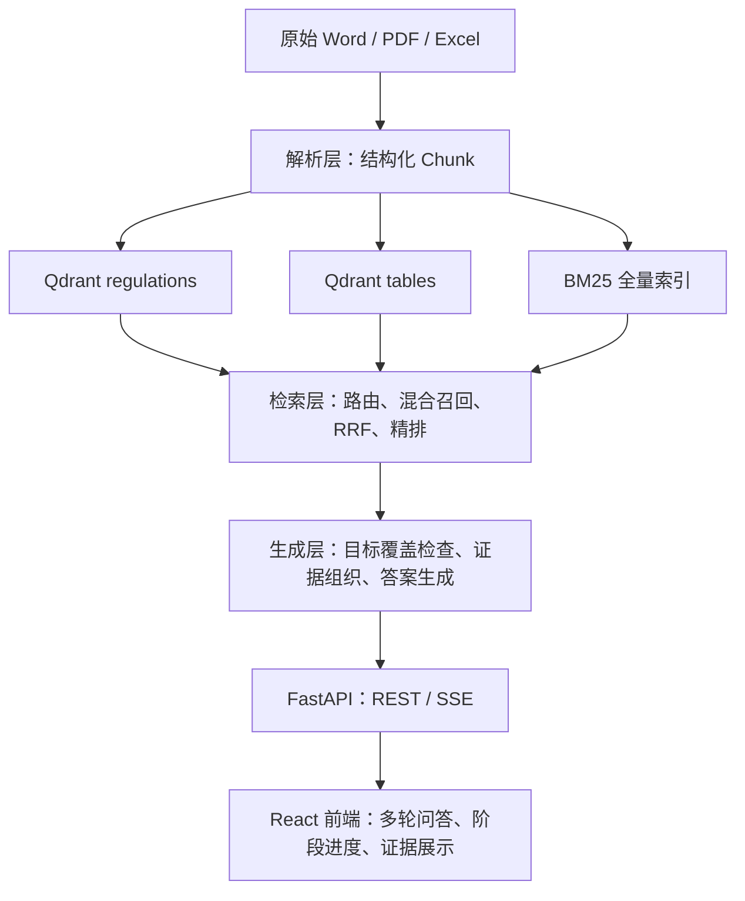
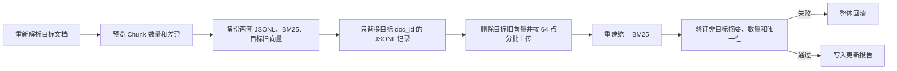
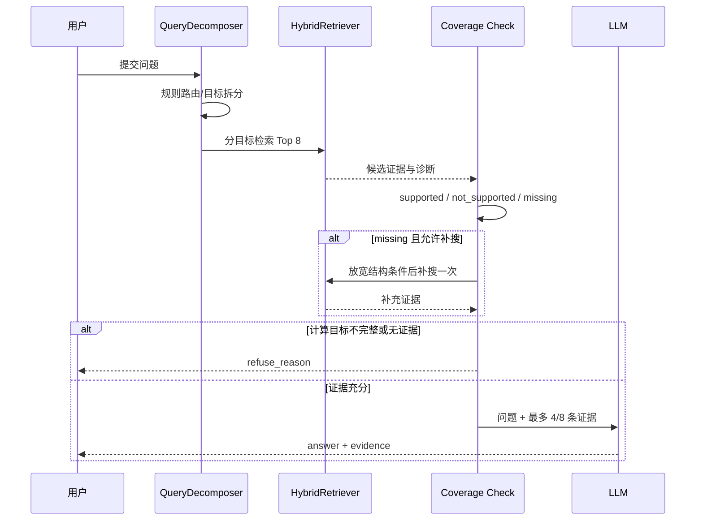
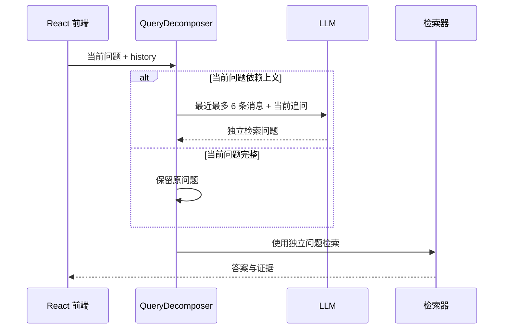

# 面向银行业监管制度与统计报表的可信 RAG 问答系统——设计文档

**项目**：第五届中国研究生金融科技创新大赛·南京银行赛题

**文档状态**：按当前实现更新

**更新日期**：2026-08-14

**技术栈**：Python、FastAPI、Qdrant、BM25、sentence-transformers、React、Vite、商业 LLM API

---

## 一、设计目标与边界

系统面向银行业监管制度和统计报表问答，核心目标不是生成通用金融知识，而是完成以下四类有依据任务：

1. 从 Word/PDF 监管文件中定位条款、名单和流程要求；
2. 从 Excel/PDF 表格中按指标、期间和表格区块取数；
3. 对检索到的结构化数值执行跨期比较和增减计算；
4. 返回可追溯证据，证据不足时拒绝作答或拒绝计算。

系统知识边界由 `data/manifest.json` 中登记且成功解析入库的文件决定。模型不得使用训练知识补足缺失的监管事实、统计数字或文件版本。

### 1.1 非目标

- 不预测股票、指数、汇率等外部市场走势；
- 不把主观 `confidence` 作为正式接口字段；
- 不用 LLM Judge 决定选择题正确与否；
- 不在证据不完整时猜测表格数字或继续计算；
- 不把处理阶段提示包装成模型的内部思考过程。

---

## 二、整体架构

系统按单向数据流划分为五层：



### 2.1 核心设计决策

| 决策 | 原因 | 约束 |
| --- | --- | --- |
| 制度与表格分为两个 Qdrant 集合 | 两类文本长度、查询意图和元数据不同，分开检索可减少干扰 | 集合名固定为 `regulations`、`tables` |
| BM25 与向量检索并行 | 文号、文件名和指标名适合精确词匹配，语义问题适合向量匹配 | 两路结果经 RRF 融合后统一精排 |
| 问题分析规则优先、LLM 兜底 | 降低简单问题的时延和不确定性 | 规则无法明确判断时才调用 LLM |
| 结构化数值用于确定性计算 | 避免 LLM 抄错数字或算错增减值 | 任一计算目标缺失则拒绝计算 |
| 每个缺失目标最多补搜一次 | 在召回率与时延之间取平衡，避免无限检索 | 仅 `missing` 目标允许补搜 |
| 正式接口只返回答案、证据和拒答原因 | 避免暴露无统一定义的主观评分 | `choice` 仅用于选择题评测 |

---

## 三、解析层设计

### 3.1 Manifest 与 Parse Profile

`data/manifest.json` 是解析入口，每条记录包含 `doc_id`、标题、发文机构、文号、发布日期、来源地址、本地路径和 `parse_profile`。`scripts/classify_manifest.py` 可为未分类文件补充 profile，`scripts/ingest.py` 按 profile 和文件后缀选择解析器。

| profile | 适用资料 | 解析和后处理 |
| --- | --- | --- |
| `regulation` | 制度类 Word/PDF | 条款拆分、超长切分、上下文增强，单块上限约 600 字 |
| `report` | 年报、报告类 PDF | 不做子条款切分，保留较长上下文，单块上限约 800 字 |
| `data` | `.xls/.xlsx` 统计表 | 单元格级数值和文本信息提取 |
| `pdf_table` | 表格型 PDF | pdfplumber 逐页提取表格 |
| `skip` | 签章页、模板等无效资料 | 不解析、不入库 |

当前个别资料存在显式分类特例，作用是修正自动分类无法可靠判断的边界文件。此类特例应保持少量、可追踪，不作为通用规则扩散。

### 3.2 Word 解析

`WordParser` 负责 `.doc/.docx`。`.doc` 文件会优先读取 `data/converted/docx/` 缓存；批量预转换工具为 `scripts/convert_doc_with_libreoffice.py`。缓存不存在时，解析器还会尝试通过本机 Word COM 临时转换；两种方式都不可用时明确报错，而不是把旧格式文件当作 `.docx` 读取。

主要步骤：

1. 读取段落和标题样式；
2. 维护章节路径，将正文挂到最近的标题层级；
3. 保留编号条目和标题后的正文；
4. 解析内嵌表格，按底层 XML 单元格对象去重合并单元格；
5. 为正文加入文档内顺序号，防止重复标题产生相同 `chunk_id`；
6. 经 `process_chunks()` 完成子条款与超长文本处理。

Word 内嵌表格每行输出一个 `table_row` 类型 Chunk，但仍进入制度侧 JSONL，以保留其所在制度文件的上下文。

### 3.3 普通 PDF 解析

`PdfParser` 负责制度和报告类 PDF：

- 逐页读取文字与字号信息；
- 结合编号形式和字号识别标题；
- 避免把大字号正文误判为标题；
- 保留标题自身正文、编号列表项、页码和章节路径；
- 根据 profile 选择不同的后处理长度和子条款策略。

PDF 版式差异较大，因此解析质量必须通过 `scripts/check_chunk_quality.py` 抽样验证，不能仅以“脚本运行成功”作为验收条件。

### 3.4 Excel 解析

`ExcelParser` 使用 `openpyxl` 读取 `.xlsx`，使用 `xlrd` 读取 `.xls`。每个工作表可能包含多个重复表格区块，解析器会分别识别表头和对应的数据区间。

主要步骤：

1. 识别一个或多个表头行；
2. 判断数据列和左侧标签列；
3. 继承多级行头，形成 `section_path`；
4. 将季度、月份等多级列头合成为 `column_header`；
5. 提取数值单元格，同时保留 `raw_value`；
6. 第二轮提取脚注、指标定义等非数值文本；
7. 使用“工作表名 + 单元格坐标”生成可定位的 `chunk_id`。

表格检索不能只依赖自然语言 `text`，还需要联合使用：

- `source_title`：来源文件；
- `section_path`：表格区块或上级分类；
- `indicator` / `row_label`：行指标；
- `column_header`：季度、月份或列口径；
- `period`：文件或工作表期间；
- `raw_value` / `unit`：计算值和展示单位。

### 3.5 PDF 表格解析

`PdfTableParser` 只用于 `parse_profile=pdf_table` 的统计型 PDF。它通过 pdfplumber 逐页提取表格，并将每个有效单元格转换为带页码、行列语义和原始值的 `table_row` Chunk。普通制度 PDF 不走该路径。

### 3.6 Chunk 数据契约

所有解析器输出 `src/parser/base.py` 中的 `Chunk`。公共字段与表格专用字段共同组成持久化契约：

```json
{
  "doc_id": "NFRA-010",
  "chunk_id": "NFRA-010#Sheet1#B6",
  "text": "文件《2023年4季度保险业资金运用情况表》；工作表「Sheet1」；单元格 B6；行指标「资金运用余额」；列口径「截至当期」；原始值为 281573.61；单位：亿元",
  "chunk_type": "table_row",
  "source_title": "2023年4季度保险业资金运用情况表",
  "issuer": "国家金融监督管理总局",
  "doc_no": "",
  "publish_date": "2024-01-01",
  "section_path": [],
  "source_url": "https://example.invalid/source",
  "local_path": "data/raw/example.xlsx",
  "table_name": "Sheet1",
  "indicator": "资金运用余额",
  "period": "2023年4季度",
  "unit": "亿元",
  "row_index": 6,
  "cell_ref": "B6",
  "row_label": "资金运用余额",
  "column_header": "截至当期",
  "raw_value": "281573.61"
}
```

上例仅用于说明字段关系，来源地址和日期不作为真实资料值。制度 Chunk 通常不包含表格专用字段，但会使用 `section_path`、`page_no` 和 `parent_chunk_id` 表达位置与父子关系。`to_dict()` 会忽略值为 `None` 的可选字段。

### 3.7 输出与当前规模

解析结果写入：

- `data/chunks/clause_chunks.jsonl`：8,945 条制度 Chunk；
- `data/chunks/table_chunks.jsonl`：29,561 条表格 Chunk；
- 合计：38,506 条，当前 `chunk_id` 全局唯一。

当前 Manifest 共 500 份资料，其中 481 份进入知识库，19 份标记为 `skip`。

---

## 四、索引与安全更新设计

### 4.1 索引组成

| 索引 | 内容 | 主要作用 |
| --- | --- | --- |
| Qdrant `regulations` | `clause_chunks.jsonl` | 制度语义检索 |
| Qdrant `tables` | `table_chunks.jsonl` | 表格语义检索 |
| `data/bm25_index.pkl` | 两套 JSONL 的全量 Chunk | 文件名、文号、指标名和精确词召回 |

Embedding 使用本地 `BAAI/bge-large-zh-v1.5`，输出 1024 维向量；精排使用本地 `BAAI/bge-reranker-base`。

`scripts/build_index.py` 支持按 Qdrant 现有 point 数断点续传。只有首次建库或全量 Chunk 内容发生变化时才应清空集合后重建。

### 4.2 单文档安全更新

单个解析器修复不应直接运行会清空两套 JSONL 的 `scripts/ingest.py`。正式入口是：

```powershell
uv run --frozen python scripts/update_documents.py --doc-ids NFRA-XXX
uv run --frozen python scripts/update_documents.py --doc-ids NFRA-XXX --apply
```

第一条只预览，第二条才写入。更新事务如下：



分批上传用于避免大文档单次请求超过服务端消息大小限制。验收必须同时满足：

1. 两套 JSONL 行数等于唯一 `chunk_id` 数；
2. Qdrant 两个集合的 point 数分别等于对应 JSONL 行数；
3. BM25 Chunk 数等于两套 JSONL 行数之和；
4. 非目标文档摘要不变；
5. 更新报告状态为 `success`。

进程被强制结束或机器断电时无法自动进入异常回滚，但备份仍可用于人工恢复，这是当前事务机制的边界。

---

## 五、问题分析与检索设计

### 5.1 问题分析

`QueryDecomposer` 同时承担问题路由、结构化目标拆分和必要的历史改写。

规则可明确识别以下问题时不调用 LLM：

- 制度条款、名单和流程问题；
- 表格单事实取数；
- 两个季度或时期的增减计算；
- 多选项表格比较；
- 多事实陈述核验；
- 选项中显式引用其他文件的跨文件问题。

规则无法明确分类时，才调用 LLM 将问题拆为 `regulation`、`table` 或混合目标；解析失败时回退为 `hybrid`，避免因分类失败直接丢失召回。

### 5.2 来源解析与限定

当问题包含文件名或分析器产生 `source_title` 提示时，BM25 先解析来源标题：

- `exact`：规范化后精确匹配；
- `alias`：使用已支持的标题别名匹配；
- `near`：近似标题匹配；
- `none`：不限定来源，保留全库召回。

匹配到唯一来源且目标要求查看完整名单/附件时，可启用 `full_source`。当该来源不超过 20 个匹配 Chunk 时，系统按 BM25 索引中的原始顺序返回全部内容，避免短名单被常规 Top-K 截断；超过 20 个时回退到常规混合检索，防止上下文无限膨胀。

### 5.3 混合检索

常规检索流程：

1. 根据问题类型选择 `regulations`、`tables` 或两个集合；
2. Qdrant 向量召回每路最多 12 个候选；
3. BM25 召回最多 12 个候选；
4. 使用 RRF（`k=60`）融合并去重；
5. 最多保留 24 个候选进入 Cross-Encoder；
6. `AnswerBuilder` 请求最终 Top 8；
7. 制度问题可在 Top 8 预算内补充最多 2 个同父块或同章节上下文。

`HybridRetriever.last_diagnostics` 记录路由、匹配来源、过滤器、候选数和各阶段耗时，供评测与排错使用，不进入正式问答响应。

### 5.4 表格目标覆盖

每个表格取数目标应同时描述“来源 + 区块 + 行指标 + 列口径”。例如“银行业金融机构总负债从一季度到四季度增加多少”会被拆为两个 operand：

```text
operand_1：来源=2023年银行业总资产、总负债（季度）
           区块=银行业金融机构，指标=总负债，列=一季度
operand_2：来源同上
           区块=银行业金融机构，指标=总负债，列=四季度
```

两个目标均找到带 `raw_value` 的结构化 Chunk 后才计算 `四季度 - 一季度`。计算使用 `Decimal`，答案同时展示两个原始值和算式；任一 operand 缺失则返回明确的 `refuse_reason`。

### 5.5 制度目标覆盖

目标覆盖状态分为：

| 状态 | 含义 | 后续动作 |
| --- | --- | --- |
| `supported` | 证据包含目标要求的关键词或结构化值 | 进入答案组织 |
| `not_supported` | 找到相关来源，但内容不支持该陈述 | 不补搜，保留否定依据 |
| `missing` | 没找到可判断目标的证据 | 条件满足时最多补搜一次 |

相邻父块、同章节 Chunk 和其他子问题已取得的同源证据可共同参与覆盖判断。这样既能减少长条款被切开造成的漏判，也不会把“找到相关文件”等同于“该陈述成立”。

---

## 六、生成、拒答与多轮上下文

### 6.1 答案生成流程



单个制度问题最多组织 4 条证据；表格、多目标或混合问题最多组织 8 条证据。多目标结果采用轮询方式合并，防止第一个目标占满全部证据预算。

### 6.2 Prompt 与正式输出

系统 Prompt 要求：

- 仅根据提供的参考资料回答；
- 保留金额、比例、日期、机构名、文号及规范强度词；
- 多项内容使用编号分行，答案保持简洁；
- 证据不足时说明原因，不使用外部知识补齐；
- 输出结构化 JSON。

正式 `/api/ask` 响应契约为：

```json
{
  "answer": "简洁的有据答案",
  "evidence": [
    {
      "source_title": "文件名称",
      "section": "章节或单元格位置",
      "text": "支持答案的原文片段",
      "source_url": "来源地址"
    }
  ],
  "refuse_reason": null,
  "latency_ms": 1240
}
```

正式响应没有 `confidence` 和 `choice`。即使旧模型意外返回 `confidence`，后处理也会移除。模型返回非 JSON 时会把原始文本作为答案兜底，同时将证据列表置空；正常 JSON 响应中的证据来自已提供给模型的检索上下文，并由 `AskResponse` 校验字段结构。

### 6.3 确定性计算与格式整理

表格增减问题在 LLM 返回后由程序基于已覆盖的 `raw_value` 生成确定性答案，从而固定数字、单位和算式。答案后处理还会规范编号换行，减少“1、2、3”挤在同一行的展示问题。

### 6.4 拒答条件

以下情况直接返回空 `answer` 和明确的 `refuse_reason`：

- 路由为库外问题或没有检索到相关 Chunk；
- 表格计算缺少任一 operand；
- 多选项比较缺少任一待比较值；
- 证据只说明相关主题，无法覆盖问题要求的事实。

拒答是一种证据完整性保护，不代表系统调用失败。API 调用异常则返回 HTTP/SSE 错误，两者在前端应区分展示。

### 6.5 多轮上下文

前端将已完成的用户问题和助手答案构造成 `history`。后端只在当前问题含有明显指代或追问表达时执行上下文化改写，例如“那具体是哪一条？”；完整、独立的问题不受上一轮内容影响。



上下文化只补全历史中明确出现的文件名、主体、指标、时间和口径，不允许猜测。改写失败时回退为“上一条用户问题 + 当前追问”。LLM 正式生成同样只接收最近最多 6 条历史消息。

### 6.6 LLM 调用恢复

`LLMClient` 对异常或空 `content` 最多尝试 3 次，退避间隔依次增加。每次调用记录 API 次数、重试次数、耗时、Token 和服务商返回的成本字段；这些指标用于评测诊断，不进入正式接口。

---

## 七、API 与前端设计

### 7.1 接口清单

| 接口 | 作用 | 当前边界 |
| --- | --- | --- |
| `POST /api/ask` | 一次性返回完整答案 | 支持 `filters` 和 `history` |
| `POST /api/ask/stream` | 通过 SSE 返回处理阶段和最终答案 | 不是逐 Token 输出 |
| `POST /api/ingest` | 运行 `scripts/ingest.py` 重新生成 JSONL | 当前不会自动更新 Qdrant/BM25，且请求中的 `manifest_path` 尚未传给脚本 |
| `GET /api/health` | 返回 API 进程状态 | 当前不检查 Qdrant、BM25、模型和 LLM 可用性 |

`/api/ingest` 的行为会覆盖两套 Chunk JSONL，因此不适合用于单文档在线更新。生产环境应优先使用经预览、备份和回滚保护的 `scripts/update_documents.py`。

### 7.2 SSE 事件契约

`POST /api/ask/stream` 使用 `text/event-stream`，当前事件包括：

```text
event: progress
data: {"stage":"analyzing","message":"正在分析问题"}

event: progress
data: {"stage":"retrieving","message":"正在检索资料"}

event: progress
data: {"stage":"organizing","message":"正在整理证据"}

event: progress
data: {"stage":"generating","message":"正在生成答案"}

event: answer
data: {"answer":"...","evidence":[],"refuse_reason":null,"latency_ms":1240}
```

异常时发送 `event: error`。服务器设置 `Cache-Control: no-cache` 和 `X-Accel-Buffering: no`，避免代理缓存进度事件。SSE 只展示系统工作阶段，不输出模型思维链。

### 7.3 前端状态

React 前端维护以下状态：

- 空状态：展示制度检索、数据取数、对比计算、证据回答四项能力；
- 提交状态：插入临时 `ProcessingCard`；
- 处理中：根据 SSE 更新四个阶段并每秒显示已用时；
- 完成：将临时卡片替换为答案卡片；
- 证据：通过 `EvidencePanel` 展开来源标题、位置、原文和链接；
- 失败/拒答：语义上分别来自 SSE `error` 或问答结果的 `refuse_reason`；当前前端都会在提示卡片中展示对应文本。

前端的“已用时”是浏览器从发送时刻开始的实时计时；回答完成后展示后端返回的 `latency_ms`。

### 7.4 部署方式

- 本地开发：Vite 将 `/api/*` 代理到 `localhost:8000`；
- FastAPI 单体演示：存在 `src/frontend/dist/` 时，后端可在 `/` 提供首页和 `/assets`；
- Docker 全栈：nginx 前端容器监听 80，反向代理 API 到后端容器；后端监听 8000，Qdrant 监听 6333。

Docker 后端启动前会构建/续传索引。宿主机 `HF_HOME` 挂载为容器 `/models`，容器设置 `HF_HUB_OFFLINE=1`，因此离线启动前必须准备好 Embedding 和 Reranker 两个模型缓存。

### 7.5 配置与安全边界

| 配置 | 作用 | 交付要求 |
| --- | --- | --- |
| `OPENAI_API_KEY` | 回答生成和选择题评测 | 只放在本机或部署环境的 `.env`，不写入代码、文档和压缩包 |
| `OPENAI_BASE_URL` / `LLM_MODEL` | 指定兼容接口和模型 | 由部署环境提供，不在代码中写死业务密钥 |
| `HF_HOME` | 两个本地模型的缓存根目录 | 在线环境可首次下载；离线交付必须预置缓存并验证目录结构 |
| `HF_HUB_OFFLINE` | 禁止运行时访问 Hugging Face | 离线演示设为 `1`，模型缺失时应直接报错 |
| `QDRANT_HOST` / `QDRANT_PORT` | 向量数据库连接 | 本地与 Docker 使用不同主机名，不能假设始终为 `localhost` |

原始监管资料、Chunk、向量索引和评测结果可能包含比赛资料内容，部署时应限制服务访问范围，不把 Qdrant 6333 端口公开到不可信网络。当前项目没有用户认证、权限分级和操作审计，因此默认定位为受控演示或内网服务，不应直接暴露为公网生产系统。

---

## 八、故障、降级与可观测性

| 场景 | 当前行为 | 排查/恢复方式 |
| --- | --- | --- |
| Qdrant 未启动 | 检索调用失败，问答无法完成 | 检查 `localhost:6333` 或 Docker 服务 |
| BM25 文件缺失或过期 | 关键词召回不可用或与向量库不一致 | 重新运行 `scripts/build_index.py` 或安全更新脚本 |
| 本地模型缓存缺失 | Embedder/Reranker 初始化失败 | 检查 `HF_HOME` 和两个模型目录，不静默下载到其他盘 |
| LLM 返回空内容 | 指数退避后重试，最多 3 次 | 查看调用诊断和中转服务状态 |
| 表格 operand 缺失 | 拒绝计算并列出缺少的目标 | 检查解析的行头、列头和区块元数据 |
| 找到文件但不支持陈述 | 标记 `not_supported`，不盲目补搜 | 展开证据核对原文 |
| SSE 中断 | 前端提示“回答流意外中断” | 检查反向代理缓冲、后端日志和网络 |
| 定向入库失败 | 安全更新脚本回滚 | 使用该次备份和 `update_report.json` 核验 |

当前可观测信息主要存在于评测结果的 `diagnostics`：问题分解方式、目标覆盖状态、各路候选数、检索阶段耗时、LLM Token/重试和总耗时。正式 API 仅返回最终 `latency_ms`，尚未提供请求 ID、结构化日志和依赖级健康检查。

---

## 九、评测设计

### 9.1 数据集与执行方式

`data/eval/QA数据.xlsx` 原有 300 题。Q075 同时跨越两个无法由题干唯一确定的表格区块，标记为 `excluded_ambiguous`，默认正式评测为 299 题；显式传入题号时仍可诊断。

评测支持：

- `--ids` 指定题号；
- `--source excel|word|pdf` 指定来源类型；
- `--run-name` 将逐题结果、进度和报告隔离到 `data/eval/runs/<name>/`；
- 已有逐题结果时断点续跑；
- 单题异常记录后继续整轮。

### 9.2 确定性判分

选择题不调用 LLM Judge，按以下顺序判分：

1. 模型结构化 `choice`；
2. 答案正文中的明确 A/B/C/D；
3. 规范化答案文本后唯一匹配某个选项；
4. 仍无法判断时标记 `unparseable`，交由人工复核。

`choice` 只存在于评测 Prompt 和评测结果，不改变正式 `/api/ask` 契约。

### 9.3 指标定义与当前结果

正式合并报告为 `data/eval/eval_report.json`。它由两批评测组成：Word/PDF 200 题和 Excel 99 题；Excel 批次中 3 道修复题使用同批次定向复测结果覆盖。该报告不是一次连续运行，合并来源保留在 `merge_sources` 中。

| 指标 | 当前结果 | 状态 |
| --- | ---: | --- |
| 总准确率 | 296/299，99.00% | 可计算 |
| 制度事实准确率 | 197/200，98.50% | 达到 85% 目标 |
| 表格准确率 | 99/99，100.00% | 达到 80% 目标 |
| 证据引用命中率 | 295/299，98.66% | 达到 90% 目标 |
| 关键实体错误率 | `unavailable` | 题库没有数字、日期、机构名、文号的结构化金标 |
| 库外拒答率 | `unavailable` | 当前评测集没有库外/依据不足题目标注 |

证据引用命中定义为：返回证据中至少一个 `source_title` 经规范化和标题别名处理后包含题库标准来源标题。它不等于“检索到了任意证据”，也不使用 `coverage_rate` 代替。

最终来源分项为 Excel 99/99、Word 100/100、PDF 97/100；剩余错误为 Q251、Q255、Q296。完整题目级结果和错误诊断以正式 JSON 报告为准。

---

## 十、目录与模块责任

```text
project/
├── data/
│   ├── raw/                         # 原始资料，不提交 Git
│   ├── converted/docx/              # .doc 转换缓存，不提交 Git
│   ├── chunks/                      # clause/table JSONL 与更新备份
│   ├── eval/                        # 题库、正式报告和分批运行结果
│   └── manifest.json                # 文件清单与 parse_profile
├── src/
│   ├── parser/                      # Word/PDF/Excel/PDF表格解析
│   ├── indexer/                     # Qdrant、BM25、Embedding
│   ├── retriever/                   # 路由、混合检索、Reranker
│   ├── generator/                   # 分解、覆盖检查、Prompt、LLM
│   ├── api/                         # REST、SSE、响应模型
│   └── frontend/                    # React、Vite、处理进度与证据展示
├── scripts/
│   ├── classify_manifest.py         # 自动分类
│   ├── ingest.py                    # 全量解析为 JSONL
│   ├── build_index.py               # 构建/续传 Qdrant 与 BM25
│   ├── update_documents.py          # 单文档安全替换与回滚
│   ├── check_chunk_quality.py       # 真实资料解析抽检
│   ├── convert_doc_with_libreoffice.py
│   └── run_eval.py                  # 端到端评测
├── tests/
├── docker-compose.yml
├── Dockerfile.backend
├── Dockerfile.frontend
├── pyproject.toml
├── uv.lock
└── CONTRIBUTING.md
```

模块间的核心契约是：

```text
Parser  -> List[Chunk]
Indexer -> JSONL 与 Qdrant/BM25 一致索引
Retriever.retrieve(query, query_type, filters, top_k, title_hint, full_source)
AnswerBuilder.answer(question, filters, history) -> AskResponse 字段
Frontend -> POST /api/ask/stream -> progress* + answer|error
```

人员分工属于项目管理信息，不在本设计文档重复维护，以免与实际团队安排产生两个版本。

---

## 十一、当前限制与后续改进

1. `/api/health` 只确认 API 进程存活，后续可增加 Qdrant、BM25、模型缓存和 LLM 的分项健康状态；
2. `/api/ingest` 只重建 JSONL，且会覆盖现有文件，后续应限制为管理接口或改为调用安全更新流程；
3. SSE 只返回阶段事件和最终答案，不是逐 Token 生成；
4. PDF 复杂版式仍依赖抽样检查，剩余 3 道错题也集中在 PDF；
5. 当前缺少专门的库外问题集和关键实体结构化金标，两项比赛指标不能客观计算；
6. 正式 API 尚未提供请求级 trace ID、持久化诊断和耗时分位数；
7. 模型缓存、原始资料、Qdrant 持久化数据和 BM25 必须作为部署资产单独管理，不能假设随 Git 仓库自动交付。

评测结果和比赛表述以[参赛技术文档](../competition/submission/技术文档.md)及 `data/eval/eval_report.json` 为准；本文件重点解释系统为何这样设计、各模块如何协作以及出现问题时如何定位。
