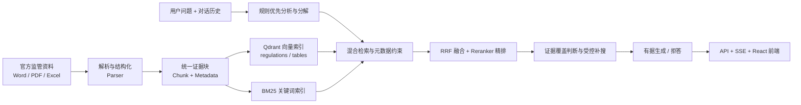
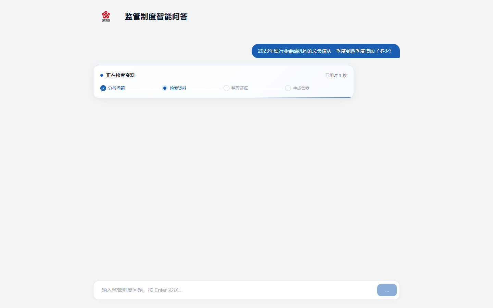

# 面向银行业监管制度与统计报表的可信 RAG 问答系统技术文档

> 文档状态：参赛提交版
> 代码基线：`3400375 feat: finalize competition evaluation and table retrieval`
> 数据与评测快照：2026 年 8 月 14 日
> 对应赛题：第五届中国研究生金融科技创新大赛·金融大模型与智能体赛道·南京银行赛题

## 摘要

银行业制度查询和监管报表分析同时涉及法规条款、业务流程、指标口径与跨期数据。传统关键词检索难以处理同名文件、版本差异、复杂表头和跨文件问题；通用大模型直接生成又容易出现数字、主体、文号或规范强度错误。针对这些问题，本项目构建了一套面向银行业监管制度与统计报表的可信检索增强生成（Retrieval-Augmented Generation，RAG）问答系统。

系统以官方公开监管资料为知识来源，对 Word、PDF、Excel 等异构文件进行结构化解析，保留文档标题、章节层级、条款编号、工作表、行列口径、期间、单位、单元格位置与来源链接。检索阶段采用关键词检索、向量检索、元数据约束、倒数排序融合和交叉编码器精排；生成阶段通过规则优先的问题分解、检索目标覆盖判断、一次受控补搜和证据约束提示词，支持制度事实查询、业务流程核对、表格取数、跨期比较、变化量计算及连续追问。正式接口只返回答案、证据、拒答原因和处理耗时，不输出主观置信度。

截至评测快照形成时，知识库 manifest 包含 500 份文件记录，其中 481 份进入解析与索引流程，形成 8,945 个制度/段落证据块和 29,561 个表格证据块，共 38,506 个全局唯一 chunk；Qdrant 中两个集合的 point 数与本地 JSONL 完全一致。299 道非歧义题的最终评测为 296 题正确，总准确率 99.00%；制度事实类准确率 98.50%，表格题准确率 100%，证据引用命中率 98.66%，三项均超过赛题建议目标。

**关键词：** 银行业监管；可信 RAG；混合检索；复杂表格解析；证据溯源；幻觉抑制

## 1. 项目背景与攻关目标

### 1.1 业务背景

信贷审批、资本管理、风险分类、消保、反洗钱、支付结算和监管报送等银行业务，需要频繁查询监管制度与统计口径。相关资料分散在不同官方渠道，文件类型和版式差异明显，人工查询容易出现以下问题：

1. 同一主题存在多份文件，容易误用旧规或相近文件。
2. 条款中的适用主体、金额阈值、期限与例外情形容易被遗漏。
3. Excel 和 PDF 表格中的多层表头、合并单元格、期间与单位难以被普通文本检索保留。
4. 跨期比较和计算需要同时找到多个操作数，缺失任一数值都可能导致错误结论。
5. 回答若无法回到原文页码、章节或单元格，难以用于实际核验。

### 1.2 总体目标

本项目以“问得准、找得到、答得清、可追溯、可复现”为目标，形成以下能力：

- 支持 Word、PDF、Excel 监管文件的批量解析和结构化索引。
- 支持制度事实、流程要求、金额阈值、保存期限、统计取数和跨期计算。
- 每个结论返回可核验的文件、章节、页码或单元格证据。
- 资料不足时拒绝推测，并说明缺失的依据或操作数。
- 提供 Web 问答界面、标准 API、评测脚本和可复现部署环境。

## 2. 技术难点与设计原则

### 2.1 多源异构文档的结构保持

制度文件的标题层级、条款编号和上下文关系具有法律语义；统计报表的指标含义则由工作表、行头、列头、期间和单位共同决定。若仅按固定字数切分，会破坏这些结构。本项目将“结构位置”作为证据的一部分，而不是只保存纯文本。

### 2.2 精确召回与语义召回的平衡

金额、期限、文号、指标名称适合关键词精确匹配；自然语言提问和同义表达更适合语义检索。系统并行使用 BM25 与向量检索，再对融合候选进行精排，避免把全部准确率押在单一检索通道上。

### 2.3 多目标问题的证据完整性

比较、计算和多事实判断不能只召回一个高相似片段。系统先把问题拆成独立检索目标，再逐目标判断证据覆盖状态。只有状态为 `missing` 时才执行一次补搜，从流程上降低“部分证据生成完整答案”的风险。

### 2.4 金融合规表达的可控性

监管回答必须区分“应当、可以、不得、原则上”等规范强度词，并保持金额、比例、日期、机构名称和文号不变。生成提示词禁止引入外部知识，计算类问题必须展示已检索到的操作数和计算过程。

## 3. 系统总体架构

系统采用五层单向流水线，解析结果先形成统一 Chunk，再分别进入索引、检索、生成和服务层。

各层职责如下：

| 层级 | 主要职责 | 关键输出 |
|---|---|---|
| Parser | 多格式解析、层级恢复、表格结构抽取 | 标准 Chunk |
| Indexer | 向量化、关键词索引、元数据存储 | Qdrant + BM25 |
| Retriever | 路由、来源限定、混合召回、融合精排 | 候选证据 |
| Generator | 分解、覆盖判断、补搜、生成、拒答 | 答案与证据 |
| API/Frontend | 问答接口、多轮历史、处理进度、证据展示 | 可交互系统 |

## 4. 数据处理与结构化知识库

### 4.1 数据清单与版本管理

`data/manifest.json` 是入库唯一清单，记录 `doc_id`、标题、发文机关、文号、发布日期、来源 URL、本地路径与解析策略。当前清单包含 500 条记录，文件类型分布为：

| 文件类型 | 数量 |
|---|---:|
| `.xls` | 232 |
| `.xlsx` | 157 |
| `.pdf` | 45 |
| `.docx` | 34 |
| `.doc` | 32 |

其中 19 份签章页、模板或不适合问答的文件标记为 `skip`，其余 481 份进入知识库。清单机制使原始文件、解析结果和来源页面可以通过 `doc_id` 追溯，便于去重和定向更新。

### 4.2 Parse Profile 路由

系统根据文档用途选择解析策略，而不是仅依据扩展名处理。

| Profile | 适用资料 | 核心策略 |
|---|---|---|
| `regulation` | Word/PDF 制度文件 | 保留标题层级和条款编号，执行子条款与长文本切分 |
| `report` | 报告类 PDF | 减少条款式切分，采用适合报告正文的长度与标点规则 |
| `data` | Excel 统计附件 | 抽取数值单元格和非数值口径说明 |
| `pdf_table` | PDF 表格 | 使用表格结构提取行列数据 |
| `skip` | 无有效问答内容的资料 | 不进入解析和索引 |

### 4.3 Word 与 PDF 解析

Word 解析器保留段落标题、章节路径、正文和内嵌表格，并对合并单元格内容去重。正文 chunk ID 加入文档内顺序号，解决重复章节标题造成的主键冲突。PDF 解析器综合字号统计和文本模式识别标题，保留页码、编号列表项和标题正文，避免把大字号正文误判为标题。

制度类文本经过以下后处理：

1. 识别并切分独立子条款。
2. 对超长段落按句子边界切分，并保留有限重叠上下文。
3. 将章节标题和父级语义写入 chunk 上下文。
4. 过滤无有效语义的碎片。

### 4.4 Excel 与 PDF 表格解析

Excel 解析器采用单元格级证据模型，同时处理：

- 多层行头与多层季度列头；
- 合并单元格传播；
- 重复表格区块；
- 指标、期间、单位、原始值和单元格坐标；
- 脚注、指标定义等非数值文本。

表格证据不会只保存一个数字，而是形成包含“文件—工作表—行指标—列口径—期间—原始值—单位—单元格”的完整语义记录。PDF 表格通过 `pdfplumber` 提取，并保留来源页码。

### 4.5 Chunk 数据契约

所有解析器统一输出 `Chunk`。核心字段包括：

- 标识字段：`chunk_id`、`doc_id`、`parent_chunk_id`；
- 来源字段：`source_title`、`source_url`、`page_no`；
- 结构字段：`section_path`、`table_name`、`chunk_type`；
- 表格字段：`indicator`、`period`、`unit`、`row_label`、`column_header`、`cell_ref`、`raw_value`；
- 内容字段：`text`。

当前形成制度证据块 8,945 条、表格证据块 29,561 条，共 38,506 条，所有 `chunk_id` 全局唯一。Qdrant 的 `regulations` 与 `tables` 集合分别为 8,945 和 29,561 个 point，状态均为 `green`；BM25 索引与两套 JSONL 使用同一批证据块构建。

## 5. 索引与混合检索

### 5.1 双集合向量索引

系统使用本地 `BAAI/bge-large-zh-v1.5` 生成 1,024 维中文语义向量，在 Qdrant 中建立两个集合：

- `regulations`：制度条款、段落和报告正文；
- `tables`：统计表格行和单元格语义记录。

制度问题只检索 `regulations`，表格问题只检索 `tables`，混合问题同时检索两个集合，从索引层减少跨类型噪声。

### 5.2 BM25 关键词索引

BM25 对全部证据块建立关键词索引，主要处理文件名称、文号、机构名称、条款编号、金额和指标名称等精确线索。索引持久化在本地，可与向量集合独立重建和校验。

### 5.3 来源标题解析与元数据约束

问题中出现明确文件名时，系统先在 BM25 元数据中解析标题。精确、近似或别名匹配成功后，将来源标题作为过滤条件。短文件且证据块不超过限定数量时，可以按原始顺序返回全文件证据；长文件继续执行混合召回。

### 5.4 候选融合与精排

每个检索通道最多召回 12 个候选，向量与 BM25 结果使用倒数排序融合（Reciprocal Rank Fusion，RRF）合并，最多保留 24 个候选进入 `BAAI/bge-reranker-base` 交叉编码器精排。正式问答流程每个检索目标默认取前 8 个结果。

制度问题精排后还会补充少量同父块或同章节上下文，使答案既能命中具体条款，又能保留必要的适用范围和上下文。

## 6. 问题分析、证据覆盖与答案生成

### 6.1 规则优先的问题路由

系统先通过确定性规则识别制度、表格和混合问题。规则覆盖文件标题、制度关键词、表格指标、季度、变化、比较和计算等表达；规则无法明确判断时，才调用大模型进行分解，并在异常时回退到混合检索。

这种设计减少了额外模型调用和路由随机性，也使常见问题的处理路径可复现。

### 6.2 多目标分解

以下问题会被拆分为多个独立检索目标：

- 两个期间的变化量或增减比较；
- 多指标比较；
- 多事实陈述或选项判断；
- 问题或选项中明确引用不同文件的场景。

表格变化问题会为每个期间分别创建操作数目标，并保留区块、指标和期间约束。只有全部操作数都有证据支持时才允许计算。

### 6.3 多轮上下文

前端每次请求携带已有用户问题和助手答案。只有检测到“那一份、该规定、它、其中、那几个”等依赖上文的追问时，系统才调用上下文化改写；完整独立问题直接检索，避免每轮无条件改写造成延迟和语义漂移。上下文化最多使用最近 6 条有效历史消息。

### 6.4 目标级证据覆盖

每个检索目标被划分为三种状态：

- `supported`：当前证据已覆盖目标要求；
- `not_supported`：已穷尽明确来源，但原文不支持该陈述；
- `missing`：仍可能缺少正确章节、来源或结构位置。

仅 `missing` 目标允许执行一次受控补搜。多个目标若解析到同一来源，可以合并相邻同父块或同章节证据判断覆盖，避免因为条款被合理切分而误判缺失。

### 6.5 有据生成与拒答

生成提示词规定：

1. 只能依据提供的参考资料作答。
2. 金额、比例、日期、机构名称和文号必须保持原文。
3. 比较问题先列数值再得出结论。
4. 计算问题先确认全部操作数，再展示计算式和结果。
5. 多项制度要求采用编号分点，单事实保持简洁。
6. 资料无关或明显不足时返回拒答原因。

对跨期变化量，系统还会利用结构化 `raw_value` 构造确定性计算结果，避免语言模型在简单算术上产生偏差。正式响应固定返回 `answer`、`evidence[]`、`refuse_reason` 和 `latency_ms`；评测专用 `choice` 不进入正式接口，主观 `confidence` 也不进入正式接口。

## 7. API、前端与交互设计

### 7.1 API

后端使用 FastAPI，主要接口包括：

| 接口 | 作用 |
|---|---|
| `POST /api/ask` | 普通问答响应 |
| `POST /api/ask/stream` | 通过 SSE 返回处理阶段与最终答案 |
| `GET /api/health` | 服务健康检查 |
| `POST /api/ingest` | 触发知识库解析流程 |

请求支持可选 `filters` 和 `history`。响应证据包含来源标题、章节/位置、原文片段和来源链接。

### 7.2 处理过程展示

流式接口不暴露模型内部思维过程，只发送可验证的系统阶段：

1. 正在分析问题；
2. 正在检索资料；
3. 正在整理证据；
4. 正在生成答案。

React 前端同步展示当前阶段和已用时，最终以答案卡片和可折叠证据面板呈现结果。该设计提高等待过程的可感知性，同时避免展示不可审计的内部推理内容。

图 1　系统首页以制度检索、数据取数、对比计算和证据回答四类能力说明系统边界。

图 2　SSE 仅展示“分析问题—检索资料—整理证据—生成答案”等可验证处理阶段及已用时，不展示模型思维链。

图 3　表格计算示例同时返回两个季度原始值、计算式、最终结果以及可展开的工作表和列口径证据。

## 8. 评测设计

### 8.1 评测集

原始评测集包含 300 道选择题，覆盖 Excel、Word、PDF 三种来源，每种来源 100 道；题型包括单事实检索、多事实检索、表格取数、表格比较和表格计算。Q075 因题干无法唯一表达两个取数区块，保留原题但标记为 `excluded_ambiguous`，默认正式评测使用其余 299 道题。

### 8.2 判分方法

评测模式要求模型返回结构化选项，并按以下顺序确定性判分：

1. 结构化 `choice`；
2. 答案正文中的明确选项字母；
3. 规范化后的选项文本或数值匹配；
4. 仍无法确定时标记为 `unparseable`，不调用 LLM Judge。

单题异常会记录错误并继续执行，使用 `--run-name` 时支持断点续传。每题同时保存路由方式、子问题、候选数量、阶段耗时、覆盖状态、补搜次数、API 调用数、Token 和服务商报告成本。

### 8.3 赛题指标口径

| 指标 | 目标 | 当前计算口径 | 最终结果 |
|---|---:|---|---:|
| 制度事实类准确率 | ≥ 85% | 单事实检索与多事实检索正确题数/对应题数 | 197/200，98.50% |
| 表格取数类准确率 | ≥ 80% | 表格取数正确题数/对应题数 | 34/34，100% |
| 表格题总体准确率（补充） | — | 取数、比较、计算正确题数/对应题数 | 99/99，100% |
| 证据引用命中率 | ≥ 90% | 返回证据至少一个来源标题规范化后包含标准来源标题 | 295/299，98.66% |
| 关键实体错误率 | ≤ 5% | 需数字、日期、机构名称和文号结构化金标准 | `unavailable` |
| 库外拒答/澄清率 | ≥ 80% | 需库外或依据不足专项题 | `unavailable` |

报告对无法可靠计算的指标明确写入 `unavailable` 和原因，不以内部 retrieval coverage 或普通拒答率替代正式指标。

### 8.4 最终评测结果

正式评测使用 `deepseek/deepseek-v4-pro` 作为生成模型，并按资料类型分两批执行，而不是一次连续运行。第一批为 Word/PDF 制度文档题，共 200 题；第二批为 Excel 表格题，共 99 题。Excel 批次完成后，Q022、Q042、Q043 因题干季度口径修正进行定向复测，其结果作为同一 Excel 批次的最终结果更新，不单独计为第三批。最终合并过程按当前题库顺序校验题号、题干、选项和标准答案，得到 299 个唯一题号；底层运行来源与覆盖关系记录在 `data/eval/eval_report.json` 的 `merge_sources` 字段中。

| 评测批次 | 题目构成 | 正确/总数 | 准确率 |
|---|---|---:|---:|
| Word/PDF 制度文档批 | Word 100 题、PDF 100 题 | 197/200 | 98.50% |
| Excel 表格批 | Excel 99 题 | 99/99 | 100% |
| **总体** | **两批共 299 题** | **296/299** | **99.00%** |

制度文档批内部，Word 为 100/100，PDF 为 97/100。

| 题型 | 正确/总数 | 准确率 |
|---|---:|---:|
| 表格取数 | 34/34 | 100% |
| 表格比较 | 33/33 | 100% |
| 表格计算 | 32/32 | 100% |
| 单事实检索 | 133/134 | 99.25% |
| 多事实检索 | 64/66 | 96.97% |

| 难度 | 正确/总数 | 准确率 |
|---|---:|---:|
| easy | 101/102 | 99.02% |
| medium | 99/99 | 100% |
| hard | 96/98 | 97.96% |

本轮纳入报告的逐题记录共发生 300 次模型 API 调用，合计 817,314 Token，服务商报告成本约 0.795 美元。总耗时均值为 62.1 秒，中位数为 41.7 秒，P95 为 115.9 秒；检索阶段中位数为 26.5 秒，生成阶段中位数为 12.7 秒。均值受到少数长尾检索影响，因此中位数更能代表常见问题的交互时延。

### 8.5 迭代效果与错题分析

首次完整 299 题运行结果为 272/299，其中 Excel 为 75/99。完成表格结构解析、来源标题去重、结构化行列过滤、比较题完整性拒答和题库季度口径审查后，Excel 提升至 99/99，总体提升至 296/299。该对比是同一题库上的工程迭代回归，不作为单变量消融实验。

最终三道错误均来自 PDF：

1. **Q251，多事实检索。** 正确选项要求同时证明两个相距较远的制度表述，当前只召回其中一项，目标级覆盖判断选择保守拒答。
2. **Q255，单事实检索。** 题干指向“寿险合同负债评估折现率曲线”，但选项和标准答案涉及同一上位通知的其他附件，来源提示与金标准之间存在跨附件歧义，系统未跨附件强行作答。
3. **Q296，多事实检索。** 行政许可材料目录篇幅较长，正确选项的两个目录项分散在不同页面；当前证据未同时覆盖两个事实，系统保守拒答。

证据引用指标另有 4 道答案正确但未通过标题包含判定：其中 2 道未返回证据，2 道返回了同一监管规则体系下更细粒度的附件标题。后续可通过完善附件—上位通知的标题层级映射，提高证据标题口径一致性。

## 9. 技术特点与创新点

### 9.1 面向监管结构的证据建模

系统没有把异构文档简单转换为纯文本，而是针对制度条款与统计表格建立不同的证据模型，使章节、条款、行列口径、单位和单元格能够随答案返回。

### 9.2 规则与模型协同的问题编排

常见制度、表格、比较和计算问题由确定性规则处理，只有不明确问题才调用模型分解。该策略兼顾可复现性和自然语言适应能力。

### 9.3 目标级覆盖控制

系统在生成前判断每个检索目标是否有充分证据，并只对缺失目标补搜。该机制区别于“召回若干相似片段后直接生成”的普通 RAG 流程。

### 9.4 可审计的答案与过程

答案附带文件、章节、页码或单元格证据；评测记录完整检索诊断；前端展示系统处理阶段而非不可审计的思维链，兼顾可信性和交互体验。

## 10. 工程实现与可复现性

### 10.1 技术栈

- 后端：Python 3.11、FastAPI、Pydantic；
- 文档解析：python-docx、pdfplumber、openpyxl 等；
- 向量模型：`BAAI/bge-large-zh-v1.5`；
- 重排模型：`BAAI/bge-reranker-base`；
- 向量数据库：Qdrant；
- 关键词检索：BM25；
- 前端：React 18、Vite、原生 CSS；
- 环境与部署：uv、Docker Compose。

### 10.2 工程验证

冻结版本共执行 132 项自动化测试，覆盖解析器、文档定向更新、检索、问题分解、答案构建、API、多轮历史、SSE 前端客户端和评测脚本，结果为 132 项全部通过。前端生产构建同时通过，Vite 共转换 38 个模块并生成静态产物。

### 10.3 模型、索引与交付环境

系统使用两个本地 Hugging Face 模型：Embedding 模型 `BAAI/bge-large-zh-v1.5` 和 Reranker 模型 `BAAI/bge-reranker-base`。联网环境将 `HF_HUB_OFFLINE=0` 时，依赖库可以根据模型名称自动下载；比赛环境的网络和缓存状态不可控，因此交付包应直接携带两个模型的最小 snapshot，并通过 `HF_HOME` 或模型相对路径加载，避免现场重复下载。

Qdrant 向量数据和 BM25 索引由本地 chunk 构建，未随 Git 仓库发布。参赛压缩包应包含预构建索引或可导入快照，以避免首次启动重新计算 38,506 个向量。每一类提交材料文件夹均按比赛要求放置 `readme.txt`，说明文件夹用途、主要文件和启动顺序。真实 API Key 不进入压缩包，只提供 `.env.example` 和配置说明。

推荐交付顺序为：载入环境变量与模型路径，启动 Qdrant，导入/挂载预构建索引，启动 FastAPI 后端，启动 nginx/前端容器，最后调用 `/api/health` 并执行一条制度题和一条表格计算题验收。

## 11. 当前局限与后续改进

1. **响应时间存在长尾。** 总耗时中位数为 41.7 秒、P95 为 115.9 秒；本地重排、补搜和外部生成接口均会影响等待时间，后续可针对候选规模和并发推理继续优化。
2. **关键实体错误率缺少结构化金标准。** 后续从评测集中抽取数字、日期、机构名称和文号，形成可自动对比的专项标注。
3. **库外拒答率缺少专项题。** 后续补充明确库外、依据不足和需要澄清的问题，区分正确拒答与错误拒答。
4. **长文档多事实覆盖仍有不足。** Q251、Q296 表明，当两个事实位于长 PDF 的远距离页面时，当前单次补搜仍可能无法形成完整证据集合。
5. **附件标题层级仍需统一。** 个别回答引用更细粒度附件标题，未命中题库使用的上位通知标题，影响证据标题指标。
6. **交付包体积较大。** 本地嵌入与重排模型需离线携带，应通过只保留实际 snapshot 和排除缓存重复文件控制体积。

## 12. 结论

本项目已经形成从多格式监管资料解析、结构化知识库、混合检索、证据覆盖控制到可溯源生成和 Web 交互的完整链路。系统的核心设计不是单纯追求语言表达，而是把来源限定、结构化证据、目标级覆盖、受控补搜和确定性评测贯穿问答全过程。冻结版本在 299 道非歧义题上取得 99.00% 总准确率，制度事实、表格取数和证据引用三项可计算指标均超过赛题建议目标；对无法可靠计算的关键实体错误率和库外拒答率则保持 `unavailable`，不以代理指标替代。结果表明，面向监管文档结构和证据完整性进行专门设计，可以显著提升异构资料问答的准确性、可核验性和工程可复现性。

## 附录 A：主要复现入口

| 任务 | 文件/命令 |
|---|---|
| 数据清单 | `data/manifest.json` |
| 全量解析 | `uv run --frozen python scripts/ingest.py` |
| 构建索引 | `uv run --frozen python scripts/build_index.py` |
| 启动后端 | `uv run --frozen python -m uvicorn src.api.main:app` |
| 启动前端 | `cd src/frontend && npm run dev` |
| 前端构建 | `cd src/frontend && npm run build` |
| 完整评测 | `uv run --frozen python scripts/run_eval.py --run-name full-299-reproduce-v1` |
| 正式评测报告 | `data/eval/eval_report.json` |
| 自动化测试 | `uv run --frozen python -m pytest tests/ -q` |

## 附录 B：结果可追溯信息

- 代码基线：`34003756c1473ea5a94ee7264e32e8ef9fe2a2d7`；
- 正式报告：`data/eval/eval_report.json`；
- 评测批次：Word/PDF 制度文档批 200 题、Excel 表格批 99 题；
- 报告内部类型：`merged_from_completed_runs`；
- 评测题数：299（Q075 因题意歧义排除）；
- 生成模型：`deepseek/deepseek-v4-pro`；
- 本地模型：`BAAI/bge-large-zh-v1.5`、`BAAI/bge-reranker-base`；
- 知识库规模：8,945 个制度块、29,561 个表格块，共 38,506 个全局唯一 chunk。
