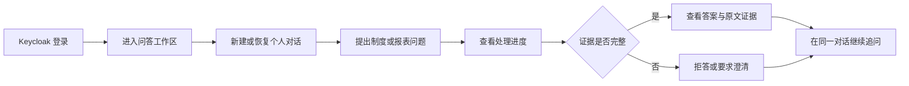
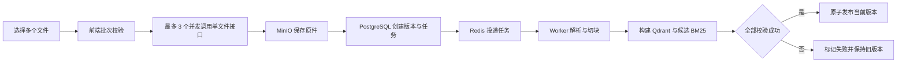

# 可信 RAG 银行业监管问答系统：产品需求说明

## 1. 文档定位

本文档汇总当前版本已经确认并实现的产品需求，便于从业务问题、用户场景和产品规则理解系统。详细功能拆分与验收标准以 [GitHub Issues](https://github.com/wxl-0/trusted-rag-banking/issues) 为准，当前产品与技术决策以 [`CONTEXT.md`](../CONTEXT.md) 为准，工程实现见[技术文档](技术文档.md)。

本文档是基于现有 Issue、代码、测试和验收证据整理的交付规格，不声称这些文字在所有功能开发之前已经完整存在。

## 2. 产品背景

银行合规、风控和监管报送人员需要同时查询监管制度、操作要求和统计报表。实际资料通常分散在 Word、PDF 和 Excel 中，存在以下问题：

- 制度文件数量多、篇幅长，人工定位条款耗时；
- PDF 表格、合并单元格和多层表头使传统文本检索难以准确取数；
- 相近年份、指标名称和统计口径容易混淆；
- 跨期、跨地区或跨文件比较需要先找齐操作数再计算；
- 通用大模型可能给出语言流畅但无法核验的结论；
- 知识资料持续更新时，命令行全量重建无法满足企业日常维护；
- 企业使用还需要登录、权限、个人对话隔离和可恢复的异步入库。

产品因此围绕“制度检索—报表取数—对比计算—证据回溯—知识维护”建立一套单企业可信知识工作台。

## 3. 产品目标

### 3.1 用户目标

1. 企业成员可以用自然语言查询监管制度和统计报表，并查看支撑结论的原文证据。
2. 用户可以在同一对话中连续追问，不必重复已经明确的来源、期间和对象。
3. 资料不足、条件不明或证据不完整时，系统应拒答或要求澄清，而不是补造答案。
4. 知识库维护者可以通过网页持续上传、查看、下载和撤回企业共享资料。
5. 入库失败、服务重启或重复投递不能污染当前可用知识。

### 3.2 产品成功标准

| 目标 | 当前公开口径 |
| --- | --- |
| 正式评测准确率 | 299 道非歧义题答对 291 道，97.32% |
| 证据引用命中率 | 296/299，99.00% |
| 开放式专项准确率 | 90/100，90.00% |
| 关键实体错误率 | 6/122，4.92% |
| 库外拒答/澄清正确率 | 28/30，93.33% |
| 跨文件回答准确率 | 17/20，85.00% |
| 工程交付 | 登录、对话、在线入库、证据问答和完整 Compose 演示链路可验收 |

评测口径、快照边界和已知局限见[评测方案与结果](评测方案与结果.md)。

## 4. 用户与角色

### 4.1 企业成员 `member`

核心任务是查询制度、取数、计算和核验答案。企业成员可以：

- 登录系统并查看自己的身份与业务角色；
- 新建、搜索、恢复、重命名和逻辑删除自己的对话；
- 发起单轮或多轮监管问答；
- 查看回答引用的文件、章节、页码、工作表或单元格证据；
- 退出登录。

企业成员不能进入知识库管理工作区，也不能调用上传、下载或撤回接口。

### 4.2 知识库维护者 `knowledge_maintainer`

维护者继承企业成员的问答能力，并负责企业共享知识库。维护者可以：

- 查看知识文档总数及成功、进行中、失败状态；
- 按文件名搜索、按状态筛选并分页浏览；
- 批量上传受支持的文档；
- 查看逐文件校验、提交和入库状态；
- 下载当前列表行对应的最新上传原件；
- 二次确认后逻辑撤回文档。

维护权限不允许查看其他用户的个人对话。Keycloak 系统管理员也不等于业务维护者。

## 5. 产品范围

### 5.1 当前范围

- 单企业、单套企业共享知识库；
- `.doc`、`.docx`、`.pdf`、`.xls`、`.xlsx` 资料处理；
- 制度条款检索、统计表格取数、比较与确定性计算；
- BM25、向量检索、RRF 融合与交叉编码器精排；
- 多目标分解、一次受控补搜、证据覆盖检查；
- 有据回答、拒答和澄清；
- Keycloak 登录和后端角色鉴权；
- PostgreSQL 个人对话、滚动摘要和知识库业务事实；
- MinIO 私有原件、Redis 异步协调、Qdrant/BM25 版本化索引；
- 单文件接口和前端受控并发批量上传；
- 入库幂等、过期任务恢复、原子发布和安全逻辑撤回；
- FastAPI REST/SSE、React 页面和 Docker Compose 演示部署。

### 5.2 当前非目标

- 多企业或多租户知识库；
- 个人私有知识库；
- 文档协同编辑和审批流；
- 维护者手工重试失败任务；
- 原件、历史 Chunk、Qdrant 点和 BM25 代际的永久物理清理；
- 同名文件静默覆盖、版本浏览和面向用户的替换上传；
- 将置信度作为正式 API 字段；
- 用 LLM Judge 替代正式选择题判分；
- 无数据、无模型、无配置即可直接使用的公共在线服务。

## 6. 核心场景

| 场景 | 用户问题 | 产品行为 |
| --- | --- | --- |
| 制度检索 | 某项业务有哪些监管要求 | 定位相关条款，回答并返回可展开原文 |
| 报表取数 | 某地区某期间指标是多少 | 匹配工作表、行列口径、单位和单元格 |
| 对比计算 | 两个期间或地区差额是多少 | 找齐操作数后执行确定性计算并同时引用来源 |
| 多事实查询 | 列出多个条件或禁止行为 | 分解检索目标，检查每个目标的证据覆盖 |
| 连续追问 | “河北呢”“两地差额呢” | 在当前对话证据唯一时解析指代，歧义时改写或澄清 |
| 库外问题 | 资料未提供相关结论 | 明确说明资料不足，不编造答案和证据 |
| 知识维护 | 上传一批新制度或报表 | 逐文件校验、异步入库，全部产物成功后才发布 |
| 文档撤回 | 某资料不再允许用于问答 | 逻辑撤回并立即退出后续检索，保留审计记录 |

## 7. 功能架构与需求编号

| 编号 | 产品能力 | 核心要求 | 关联 Issue |
| --- | --- | --- | --- |
| PR-01 | 身份与权限 | Keycloak 登录；后端校验身份、角色、issuer、audience 和有效期 | [#3](https://github.com/wxl-0/trusted-rag-banking/issues/3) |
| PR-02 | 持久化对话 | 服务端保存对话、消息、证据和标题，按用户隔离 | [#4](https://github.com/wxl-0/trusted-rag-banking/issues/4)、[#5](https://github.com/wxl-0/trusted-rag-banking/issues/5) |
| PR-03 | 受控长对话 | 使用滚动摘要、近期消息和 token 预算装配模型上下文 | [#6](https://github.com/wxl-0/trusted-rag-banking/issues/6) |
| PR-04 | 可信问答 | 混合检索、目标覆盖、证据 ID 约束、拒答/澄清和确定性计算 | [#19](https://github.com/wxl-0/trusted-rag-banking/issues/19)、[#20](https://github.com/wxl-0/trusted-rag-banking/issues/20)、[#17](https://github.com/wxl-0/trusted-rag-banking/issues/17) |
| PR-05 | 知识库浏览 | 状态汇总、搜索、筛选、分页和权限隔离 | [#7](https://github.com/wxl-0/trusted-rag-banking/issues/7) |
| PR-06 | 文档上传 | 单文件安全受理；批量选择、并发 3、逐文件结果和部分成功 | [#8](https://github.com/wxl-0/trusted-rag-banking/issues/8)、[#14](https://github.com/wxl-0/trusted-rag-banking/issues/14) |
| PR-07 | 异步入库 | 单文档解析、不可变产物、Qdrant/BM25 构建和成功后发布 | [#18](https://github.com/wxl-0/trusted-rag-banking/issues/18)、[#9](https://github.com/wxl-0/trusted-rag-banking/issues/9) |
| PR-08 | 一致性与恢复 | 原子版本切换、幂等重投递、过期任务恢复和候选清理 | [#10](https://github.com/wxl-0/trusted-rag-banking/issues/10)、[#12](https://github.com/wxl-0/trusted-rag-banking/issues/12) |
| PR-09 | 原件与撤回 | 维护者鉴权下载；逻辑撤回立即停止检索并审计 | [#11](https://github.com/wxl-0/trusted-rag-banking/issues/11)、[#15](https://github.com/wxl-0/trusted-rag-banking/issues/15) |
| PR-10 | 评测与回归 | 正式评测、开放式专项评测和可追溯 Bad Case 回归闭环 | [#21](https://github.com/wxl-0/trusted-rag-banking/issues/21)、[#22](https://github.com/wxl-0/trusted-rag-banking/issues/22)、[#16](https://github.com/wxl-0/trusted-rag-banking/issues/16) |
| PR-11 | 全栈交付 | 正式前端、完整依赖、可重复演示、文档与实现一致 | [#13](https://github.com/wxl-0/trusted-rag-banking/issues/13) |

完整需求到实现、测试和提交的映射见[需求追溯矩阵](需求追溯矩阵.md)。

#18～#22 为依据 Git、测试与历史评测记录补建的历史规格，Issue 顶部均标明重建属性和原始实施阶段，不作为“开发前已经存在工单”的证明。

## 8. 核心用户流程

### 8.1 企业成员问答

### 8.2 维护者入库

## 9. 关键产品规则

### 9.1 可信回答

1. 回答只能使用本次检索得到的参考证据。
2. 模型只返回证据 ID，正式证据内容由后端从候选 Chunk 重建。
3. 数值、比例和日期必须能在所选证据中核验。
4. 多目标问题必须逐项检查来源、结构位置和内容覆盖。
5. 只对 `missing` 目标执行一次受控补搜；`not_supported` 不盲目补搜。
6. 计算题必须取得全部操作数、期间、单位和口径后才计算。
7. 资料缺失或不支持结论时拒答；条件或口径不明确时澄清。

### 9.2 对话与上下文

1. 对话及消息归属于一个经认证用户。
2. 浏览器传入的任意历史不是正式会话事实，服务端从 PostgreSQL 读取历史。
3. 完整原始消息保留，模型只接收当前问题需要的摘要、近期消息和证据。
4. 上下文按 64K、128K、200K 分层预算控制，并为输出预留 8K–16K token。
5. 规则能够唯一恢复来源、期间和对象时优先完成短追问指代消解；否则进入上下文化改写或澄清。

### 9.3 上传与入库

1. 单批最多 10 个文件，单文件默认最多 50 MiB，批次总计最多 200 MiB。
2. 同一批次重名由前端拒绝；活动知识库同名由后端拒绝。
3. 单个文件失败不回滚其他已受理文件。
4. 上传接口返回任务后，浏览器不等待解析和索引完成。
5. 只有原件、Chunk、Qdrant 和 BM25 全部校验成功后才发布。
6. 候选版本处理中或失败时，旧版本继续服务。

## 10. 权限矩阵

| 能力 | 企业成员 | 知识库维护者 |
| --- | :---: | :---: |
| 登录、退出和查看本人身份 | ✓ | ✓ |
| 提问和查看证据 | ✓ | ✓ |
| 管理本人对话 | ✓ | ✓ |
| 查看企业知识文档 | — | ✓ |
| 上传知识文档 | — | ✓ |
| 下载最新上传原件 | — | ✓ |
| 逻辑撤回知识文档 | — | ✓ |
| 查看其他成员对话 | — | — |
| 管理 Keycloak 系统 | — | — |

前端显示规则只改善体验，真正的权限边界由后端鉴权和资源归属校验保证。

## 11. 非功能要求

### 11.1 安全

- 原文件保存于私有对象存储，不暴露 MinIO 地址和凭据；
- 令牌身份、角色和资源归属由后端校验；
- 用户可见错误不返回内部异常栈；
- 上传、撤回等重要操作保留审计事实；
- 公开仓库不包含真实凭据、原始监管资料和可还原私有题目的评测明细。

### 11.2 一致性与可靠性

- PostgreSQL 是业务事实来源；
- 重复任务投递不能产生重复活动版本；
- 服务重启后可恢复排队或租约过期任务；
- 新版本失败不得使旧版本不可用；
- 当前版本过滤同时约束向量和关键词检索。

### 11.3 可用性与可诊断性

- SSE 向用户展示处理阶段和耗时；
- 文档列表使用稳定分页、搜索和状态筛选；
- 存活检查与依赖就绪检查分离；
- 评测和服务端日志记录分解、候选、覆盖、补搜和阶段耗时；
- 面向用户只输出稳定状态和安全中文消息。

## 12. 版本与后续规划

当前版本已完成从可信问答到企业知识维护的闭环。下一阶段优先事项是：

1. 为失败入库任务提供维护者手工重试；
2. 明确保留期限并实现永久物理清理；
3. 改善条件澄清、制度多事实覆盖和比例单位换算；
4. 在统一硬件环境建立响应延迟和资源消耗基线；
5. 如需支持同文档更新，再单独定义替换上传、版本浏览和回滚交互。

任何下一阶段能力在实现和验收前不得写入“当前已实现”范围。
