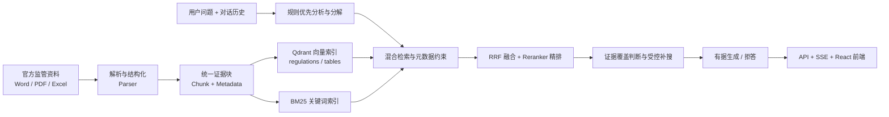
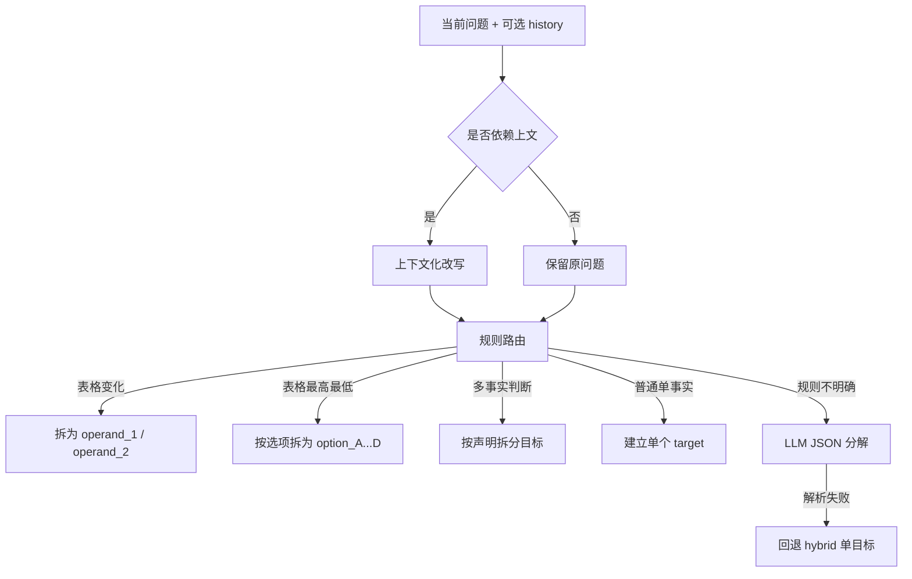
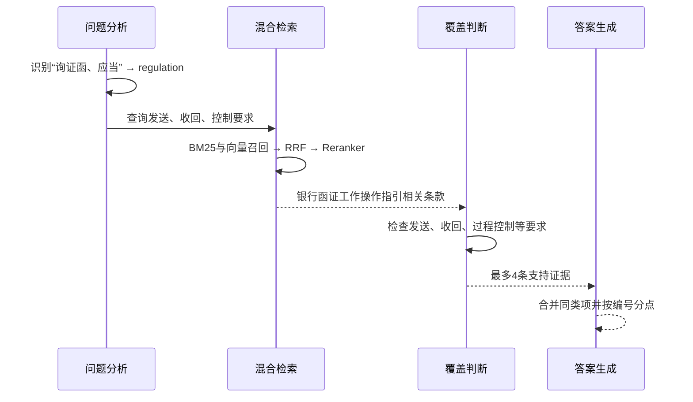
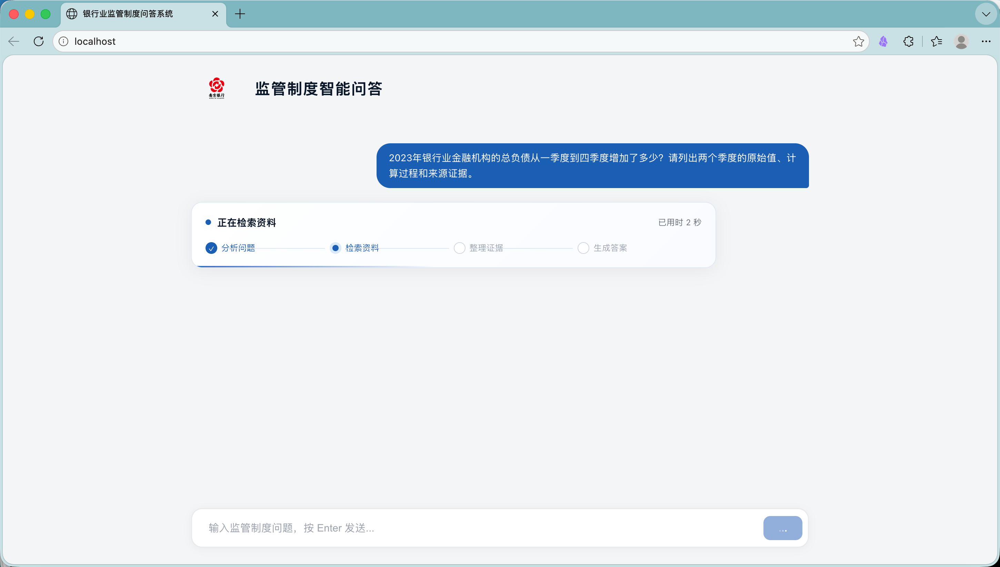
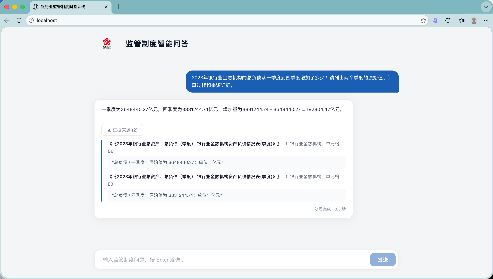

# 面向银行业监管制度与统计报表的可信 RAG 问答系统技术文档

> 文档定位：公开仓库作品展示版。本文档在比赛提交版基础上按当前仓库与最终验证结果更新，不代替已经冻结的比赛提交材料。
>
> 实现基线：以本仓库 `main` 当前源码为准。本文明确区分“正式代码已实现”“静态原型已完成”和“方案已确认但尚未开发”。

## 摘要

银行业制度查询和监管报表分析同时涉及法规条款、业务流程、指标口径与跨期数据。传统关键词检索难以处理同名文件、版本差异、复杂表头和跨文件问题；通用大模型直接生成又容易出现数字、主体、文号或规范强度错误。针对这些问题，本项目构建了一套面向银行业监管制度与统计报表的可信检索增强生成（Retrieval-Augmented Generation，RAG）问答系统。

系统以官方公开监管资料为知识来源，对 Word、PDF、Excel 等异构文件进行结构化解析，保留文档标题、章节层级、条款编号、工作表、行列口径、期间、单位、单元格位置与来源链接。检索阶段采用关键词检索、向量检索、元数据约束、倒数排序融合和交叉编码器精排；生成阶段通过规则优先的问题分解、检索目标覆盖判断、一次受控补搜和证据约束提示词，支持制度事实查询、业务流程核对、表格取数、跨期比较、变化量计算及连续追问。正式接口只返回答案、证据、拒答原因和处理耗时，不输出主观置信度。

截至评测快照形成时，知识库 manifest 包含 500 份文件记录，其中 481 份进入解析与索引流程，形成 8,945 个制度/段落证据块和 29,561 个表格证据块，共 38,506 个全局唯一 chunk；Qdrant 中两个集合的 point 数与本地 JSONL 完全一致。299 道非歧义题的最终评测使用 `deepseek-v4-flash`，共答对 291 题，总准确率 97.32%；制度事实类准确率为 96.50%，表格题总体准确率为 98.99%，证据引用命中率为 99.00%，三项均超过赛题建议目标。另以独立的 100 道开放式专项集评测关键实体、库外处理和双 Excel 跨期问答：总体答对 90/100（90.00%），关键实体错误率为 6/122（4.92%），库外处理正确率为 28/30（93.33%），跨文件回答准确率和按文件、单元格、期间、指标与数值联合核验的证据命中率均为 85.00%。

### 实现状态说明

| 状态 | 范围 |
|---|---|
| 正式代码已实现 | Parser、Indexer、Retriever、Generator、FastAPI REST/SSE、React 问答与历史侧栏、命令行建库、Keycloak 访问控制、PostgreSQL 对话与滚动摘要、维护者知识库管理，以及在线上传受理、MinIO 私有原件、Redis 任务排队和上传接受审计 |
| 静态原型已完成 | 角色视图、知识库管理、上传和异步入库状态，位于 `prototype/`；登录、账户区、问答、个人历史侧栏、维护者知识库页和上传弹窗已接入正式 React |
| 方案已确认但尚未开发 | 后台异步解析/索引、状态推进、重试、下载和删除 |

除非明确标记为原型或规划，本文其余“当前系统”均指正式代码已经具备的能力。

**关键词：** 银行业监管；可信 RAG；混合检索；复杂表格解析；证据溯源；幻觉抑制

## 1. 项目背景与攻关目标

### 1.1 业务背景

信贷审批、资本管理、风险分类、消保、反洗钱、支付结算和监管报送等银行业务，需要频繁查询监管制度与统计口径。相关资料分散在不同官方渠道，文件类型和版式差异明显，人工查询容易出现以下问题：

1. 同一主题存在多份文件，容易误用旧规或相近文件。
2. 条款中的适用主体、金额阈值、期限与例外情形容易被遗漏。
3. Excel 和 PDF 表格中的多层表头、合并单元格、期间与单位难以被普通文本检索保留。
4. 跨期比较和计算需要同时找到多个操作数，缺失任一数值都可能导致错误结论。
5. 回答若无法回到原文页码、章节或单元格，难以用于实际核验。

### 1.2 总体目标

本项目以“问得准、找得到、答得清、可追溯、可复现”为目标，形成以下能力：

- 支持 Word、PDF、Excel 监管文件的批量解析和结构化索引。
- 支持制度事实、流程要求、金额阈值、保存期限、统计取数和跨期计算。
- 每个结论返回可核验的文件、章节、页码或单元格证据。
- 资料不足时拒绝推测，并说明缺失的依据或操作数。
- 提供 Web 问答界面、标准 API、评测脚本和可复现部署环境。

## 2. 技术难点与设计原则

### 2.1 多源异构文档的结构保持

制度文件的标题层级、条款编号和上下文关系具有法律语义；统计报表的指标含义则由工作表、行头、列头、期间和单位共同决定。若仅按固定字数切分，会破坏这些结构。本项目将“结构位置”作为证据的一部分，而不是只保存纯文本。

### 2.2 精确召回与语义召回的平衡

金额、期限、文号、指标名称适合关键词精确匹配；自然语言提问和同义表达更适合语义检索。系统并行使用 BM25 与向量检索，再对融合候选进行精排，避免把全部准确率押在单一检索通道上。

### 2.3 多目标问题的证据完整性

比较、计算和多事实判断不能只召回一个高相似片段。系统先把问题拆成独立检索目标，再逐目标判断证据覆盖状态。只有状态为 `missing` 时才执行一次补搜，从流程上降低“部分证据生成完整答案”的风险。

### 2.4 金融合规表达的可控性

监管回答必须区分“应当、可以、不得、原则上”等规范强度词，并保持金额、比例、日期、机构名称和文号不变。生成提示词禁止引入外部知识，计算类问题必须展示已检索到的操作数和计算过程。

## 3. 系统总体架构

系统采用五层单向流水线，解析结果先形成统一 Chunk，再分别进入索引、检索、生成和服务层。



各层职责如下：

| 层级 | 主要职责 | 关键输出 |
|---|---|---|
| Parser | 多格式解析、层级恢复、表格结构抽取 | 标准 Chunk |
| Indexer | 向量化、关键词索引、元数据存储 | Qdrant + BM25 |
| Retriever | 路由、来源限定、混合召回、融合精排 | 候选证据 |
| Generator | 分解、覆盖判断、补搜、生成、拒答 | 答案与证据 |
| API/Frontend | 问答与个人历史、处理进度、证据展示、维护者知识库查看与上传受理 | 可交互系统 |

## 4. 数据处理与结构化知识库

### 4.1 数据清单与可追溯标识

`data/manifest.json` 是入库唯一清单，记录 `doc_id`、标题、发文机关、文号、发布日期、来源 URL、本地路径与解析策略。当前清单包含 500 条记录，文件类型分布为：

| 文件类型 | 数量 |
|---|---:|
| `.xls` | 232 |
| `.xlsx` | 157 |
| `.pdf` | 45 |
| `.docx` | 34 |
| `.doc` | 32 |

其中 19 份签章页、模板或不适合问答的文件标记为 `skip`，其余 481 份进入知识库。清单机制使原始文件、解析结果和来源页面可以通过 `doc_id` 追溯，便于去重和定向更新。PostgreSQL 已提供知识文档、版本和任务表；新上传原件可保存到 MinIO 并通过 Redis 排队，但当前 Manifest/命令行建库尚未回填这些业务表，排队任务也尚无后台处理器。

### 4.2 Parse Profile 路由

系统根据文档用途选择解析策略，而不是仅依据扩展名处理。

| Profile | 适用资料 | 核心策略 |
|---|---|---|
| `regulation` | Word/PDF 制度文件 | 保留标题层级和条款编号，执行子条款与长文本切分 |
| `report` | 报告类 PDF | 减少条款式切分，采用适合报告正文的长度与标点规则 |
| `data` | Excel 统计附件 | 抽取数值单元格和非数值口径说明 |
| `pdf_table` | PDF 表格 | 使用表格结构提取行列数据 |
| `skip` | 无有效问答内容的资料 | 不进入解析和索引 |

### 4.3 Word 与 PDF 解析

Word 解析器保留段落标题、章节路径、正文和内嵌表格，并对合并单元格内容去重。正文 chunk ID 加入文档内顺序号，解决重复章节标题造成的主键冲突。PDF 解析器综合字号统计和文本模式识别标题，保留页码、编号列表项和标题正文，避免把大字号正文误判为标题。

解析器首先依据文档结构形成语义块，再进入统一的 Chunk 后处理管道。该顺序与“先抽取全文、再按固定字符切分”不同：标题层级、条款关系和来源位置在切分前已经确定，因此子块仍能继承父级章节和来源信息。

制度类文本依次经过以下处理：

1. **子条款切分。** 识别“（一）”“(一)”和句后“1.”“1、”等编号边界，将同一段中的独立要求拆成子块。子块 ID 在父块后追加 `#K序号`，并保留 `parent_chunk_id`。
2. **超长切分。** 优先在句号、分号等句界处切分，不直接从字符中间截断。超长子块追加 `#S序号`，继续继承原始父块。
3. **有限重叠。** 相邻长文本块保留前一块末尾 80 字，降低定义、条件和结论刚好跨越边界时的语义损失。
4. **上下文增强。** 在正文前加入文件标题和 `section_path`，使单个块脱离原文位置后仍包含来源与章节语义。
5. **噪声过滤。** 过滤少于 10 字的碎片，以及“本页无正文、目录、附件清单、填表说明”等已知噪声前缀。

| 参数 | `regulation` | `report` | 设计考虑 |
|---|---:|---:|---|
| 子条款切分 | 开启 | 关闭 | 制度条款编号边界明确；报告正文更依赖连续语境 |
| 单块最大长度 | 600 字 | 800 字 | 在精确定位与上下文完整性之间取平衡 |
| 长块重叠 | 80 字 | 80 字 | 只保留边界必要上下文，避免大面积重复 |
| 句界字符 | `。；` | `。；.;` | 报告可能包含中英文混排 |
| 最短有效长度 | 10 字 | 10 字 | 去除目录和版式碎片，不误删正常短条款 |

这些值是当前工程参数，而不是声称在所有资料上都达到理论最优。系统通过真实文档抽检和正式题库回归验证其有效性；资料版式发生变化时，应先抽样检查，再调整参数。

### 4.4 Excel 与 PDF 表格解析

Excel 解析器采用单元格级证据模型，同时处理：

- 多层行头与多层季度列头；
- 合并单元格传播；
- 重复表格区块；
- 指标、期间、单位、原始值和单元格坐标；
- 脚注、指标定义等非数值文本。

表格证据不会只保存一个数字，而是形成包含“文件—工作表—行指标—列口径—期间—原始值—单位—单元格”的完整语义记录。PDF 表格通过 `pdfplumber` 提取，并保留来源页码。

表格块不经过600/800字的文本切分，而是以单元格为基本事实单位。以一个季度数值为例，其语义并不只由数值决定，而是由以下维度共同确定：

```text
来源文件 + 工作表/表格区块 + 上级行头 + 行指标
+ 列口径/季度 + 期间 + 单位 + 原始值 + 单元格位置
```

解析器先识别一个工作表中的一个或多个表头区间，再识别数据列和左侧标签列。多级行头通过上级分组上下文写入 `section_path`；列头写入 `column_header`；同一工作表出现第二个表格区块时重新识别表头，避免把前一表格的列口径错误沿用到后一表格。数值单元格写入 `raw_value`，脚注和指标定义在第二轮作为非数值证据保留。

表格块示例如下：

```json
{
  "chunk_id": "NFRA-134#2023年4季度保险资金运用情况表#B6",
  "chunk_type": "table_row",
  "source_title": "2023年4季度保险业资金运用情况表 2023年四季度保险业资金运用情况表",
  "table_name": "2023年4季度保险资金运用情况表",
  "section_path": [],
  "row_label": "资金运用余额",
  "column_header": "截至当期",
  "period": "2023年4季度",
  "raw_value": "281573.609414449",
  "unit": "单位：亿元",
  "cell_ref": "B6"
}
```

这是真实入库Chunk的字段摘录。面向用户的 `text` 会将该值展示为 `281573.61`，而 `raw_value` 保留底层数值精度。确定性计算优先读取 `text` 中的展示值，使计算口径与用户看到的报表精度一致；展示值无法解析时才回退到 `raw_value`。这些结构字段同时用于过滤和计算，系统不需要再让大模型从一段表格文本中猜测行列关系。

### 4.5 Chunk 数据契约

所有解析器统一输出 `Chunk`。核心字段包括：

- 标识字段：`chunk_id`、`doc_id`、`parent_chunk_id`；
- 来源字段：`source_title`、`source_url`、`page_no`；
- 结构字段：`section_path`、`table_name`、`chunk_type`；
- 表格字段：`indicator`、`period`、`unit`、`row_label`、`column_header`、`cell_ref`、`raw_value`；
- 内容字段：`text`。

当前形成制度证据块 8,945 条、表格证据块 29,561 条，共 38,506 条，所有 `chunk_id` 全局唯一。Qdrant 的 `regulations` 与 `tables` 集合分别为 8,945 和 29,561 个 point，状态均为 `green`；BM25 索引与两套 JSONL 使用同一批证据块构建。

### 4.6 数据质量检查与定向更新

全量解析由 `scripts/ingest.py` 生成两套 JSONL。该脚本会重新创建输出文件，适用于首次建库或确认要全量重建的场景；单个解析器修复不能直接用它替换线上知识库，否则容易让未完成转换或暂时缺失的原始文件从结果中消失。

针对单文档修复，系统提供 `scripts/update_documents.py`：


Qdrant 定向上传每批固定为 64 个 point，避免长文档单请求超过服务端消息大小限制。一次更新只有同时满足以下条件才视为成功：

1. 两套 JSONL 的行数分别等于各自唯一 `chunk_id` 数；
2. `regulations`、`tables` 的 point 数分别等于对应 JSONL 行数；
3. BM25 的证据块总数等于两套 JSONL 之和；
4. 非目标文档摘要保持不变；
5. 更新报告状态为 `success`。

这一机制将“解析器修改”和“知识库数据变更”分开控制，使单文档修复具备预览、备份、验证和回滚证据。

## 5. 索引与混合检索

### 5.1 双集合向量索引

系统使用本地 `BAAI/bge-large-zh-v1.5` 生成 1,024 维中文语义向量，在 Qdrant 中建立两个集合：

- `regulations`：制度条款、段落和报告正文；
- `tables`：统计表格行和单元格语义记录。

制度问题只检索 `regulations`，表格问题只检索 `tables`，混合问题同时检索两个集合，从索引层减少跨类型噪声。

### 5.2 BM25 关键词索引

BM25 对全部证据块建立关键词索引，主要处理文件名称、文号、机构名称、条款编号、金额和指标名称等精确线索。索引持久化在本地，可与向量集合独立重建和校验。

### 5.3 来源标题解析与元数据约束

问题中出现明确文件名时，系统先在 BM25 元数据中解析标题，再决定是否限定检索范围。标题匹配分四级：

1. `exact`：去除书名号、空格、标点并转为小写后完全一致；
2. `near`：规范化标题互为包含关系，最多保留长度差最小的 5 个候选；
3. `alias`：去除“PDF/Word/Excel”等后缀，统一“财产保险公司/财产险公司”等已知别名；规范化标题能唯一互相包含时直接命中，否则再比较字符串相似度；
4. `none`：无法唯一确认来源，不强行限定文件，保留全库检索。

别名无法通过唯一包含关系确定时，只有最佳标题相似度不低于 0.78，且比第二名至少高 0.08 才命中，避免两个相近附件被静默选错。精确、近似或别名匹配成功后，将解析得到的真实 `source_title` 写入元数据过滤条件，而不是直接使用用户输入字符串过滤。

当问题要求核验短名单、附件全文或完整目录时，分析器可以设置 `full_source=true`。只有唯一来源且符合条件的 Chunk 不超过 20 个时，系统才按索引原始顺序返回全部内容；超过20个时回退到常规混合召回，防止长文件整体进入上下文。

其他可用过滤字段包括 `issuer`、`doc_no`、`period`、`chunk_type` 以及表格专用的 `table_name`、`row_label`、`indicator`、`column_header` 和 `section_path`。文件标题限定解决“去哪份文件找”，表格结构过滤解决“找哪一行哪一列”，两者作用不同。

### 5.4 候选融合与精排

检索器接收 `query`、`query_type`、`filters`、`top_k`、`title_hint` 和 `full_source`。常规路径按以下顺序执行：

1. `regulation` 只检索 `regulations`，`table` 只检索 `tables`，`hybrid` 同时检索两个集合；
2. Qdrant 在每个选中的集合中最多召回 12 个向量候选；
3. BM25 在全量索引中按类型和元数据过滤后最多召回 12 个候选；
4. 两路结果以 `chunk_id` 去重并通过 RRF 融合；
5. 融合结果最多保留 24 个进入交叉编码器精排；
6. `AnswerBuilder` 对每个检索目标取得前 8 个结果。

RRF 不直接比较 BM25 分数和向量相似度，而是只使用各结果在通道中的名次：

```text
RRF(d) = Σ 1 / (60 + rank_i(d) + 1)
```

其中 `rank_i(d)` 是证据块 `d` 在第 `i` 个召回通道中的从零开始排名，常数60用于降低头部名次波动的影响。同一 Chunk 同时被关键词和语义检索命中时会累加两路分数，因此自然获得更高融合排序。

| 参数 | 当前值 | 作用与取舍 |
|---|---:|---|
| 向量候选 | 每个集合 12 | 保留语义候选，同时控制本地精排开销 |
| BM25候选 | 12 | 覆盖标题、文号、指标和数字等精确线索 |
| RRF常数 | 60 | 平滑不同通道的名次差异 |
| 精排输入上限 | 24 | 限制 Cross-Encoder 推理时延 |
| 每目标最终结果 | 8 | 为多事实覆盖保留空间，又避免Prompt过长 |
| 同章节上下文 | 最多2个 | 补足适用范围，不突破最终Top 8预算 |
| 短来源全量阈值 | 20 | 适合短名单；长来源继续走相关性检索 |

制度问题精排后还会补充少量同父块或同章节上下文，使答案既能命中具体条款，又能保留必要的适用范围和上下文。

这些参数共同控制召回率、精排耗时和生成上下文长度。它们是当前题库与本地模型下的工程配置，不等同于单变量消融得到的全局最优参数；文档不把工程回归结果误写为参数最优性证明。

### 5.5 检索诊断与可追溯参数

每次检索都会在诊断信息中记录：路由类型、检索策略、标题提示、标题匹配方式、实际命中标题、最终过滤器、向量/BM25/融合/上下文/最终候选数量，以及各阶段耗时。诊断数据用于评测和错题分析，不进入正式问答接口。

该记录能够区分三类问题：

- **解析缺失**：正确事实根本没有形成 Chunk；
- **召回或精排失败**：正确 Chunk 已入库但未进入最终结果；
- **生成或覆盖失败**：证据已取得，但系统拒答、选项判断或答案组织错误。

因此，评测失败不会只被归结为“模型答错”，而可以继续定位到具体阶段和参数。

## 6. 问题分析、证据覆盖与答案生成

### 6.1 规则优先的问题路由

系统先通过确定性规则识别制度、表格和混合问题。规则覆盖文件标题、制度关键词、表格指标、季度、变化、比较和计算等表达；规则无法明确判断时，才调用大模型进行分解，并在异常时回退到混合检索。

这种设计减少了额外模型调用和路由随机性，也使常见问题的处理路径可复现。

问题分析按以下顺序执行：



| 线索 | 典型表达 | 路由/动作 |
|---|---|---|
| 制度线索 | 办法、规定、指引、应当、不得、名单、询证函 | `regulation` |
| 表格线索 | 工作表、余额、收入、季度、总资产、总负债、增加、比较 | `table` |
| 两类线索同时出现 | “监管要求是否高于当期数据”等 | `hybrid` |
| 两个时期变化 | 从一季度到四季度增加多少 | 拆为两个表格操作数 |
| 最高/最低选项 | 四个机构中哪项最高 | 每个选项建立一个取数目标 |
| 两项表述均正确 | 一个选项含两个独立事实 | 每项事实分别检查覆盖 |

规则路由并非关键词出现即直接生成答案，它只决定后续检索目标和索引范围。所有事实仍必须通过知识库证据覆盖检查。

### 6.2 多目标分解

以下问题会被拆分为多个独立检索目标：

- 两个期间的变化量或增减比较；
- 多指标比较；
- 多事实陈述或选项判断；
- 问题或选项中明确引用不同文件的场景。

表格变化问题会为每个期间分别创建操作数目标，并保留区块、指标和期间约束。只有全部操作数都有证据支持时才允许计算。

内部检索目标包含以下关键字段：

| 字段 | 作用 |
|---|---|
| `target_id` | 标识普通目标、计算操作数或比较选项 |
| `question` | 实际送入检索器的独立查询 |
| `type` | `regulation`、`table` 或 `hybrid` |
| `source_title` | 用户明确引用或规则解析出的文件标题提示 |
| `filters` | 补搜时仍需保留的宽松过滤条件 |
| `strict_filters` | 首轮检索的结构化精确条件 |
| `coverage_terms` | 判断目标是否被证据覆盖的关键语义 |
| `full_source` | 是否尝试读取短来源的全部 Chunk |

例如“2023年银行业金融机构的总负债从一季度到四季度增加多少”会形成两个目标：

```json
[
  {
    "target_id": "operand_1",
    "type": "table",
    "strict_filters": {
      "section_path": "银行业金融机构",
      "row_label": "总负债",
      "column_header": "一季度"
    },
    "coverage_terms": ["银行业金融机构", "总负债", "一季度"]
  },
  {
    "target_id": "operand_2",
    "type": "table",
    "strict_filters": {
      "section_path": "银行业金融机构",
      "row_label": "总负债",
      "column_header": "四季度"
    },
    "coverage_terms": ["银行业金融机构", "总负债", "四季度"]
  }
]
```

将两个季度拆开检索，是为了避免只找到四季度数值后仍让模型自行补出一季度数值。

### 6.3 多轮上下文

当前正式 React 在首次提问前创建个人对话，流式请求只携带 `conversation_id`、幂等 `request_id` 和当前问题。服务端校验 Keycloak subject 与对话归属，从 PostgreSQL 读取已完成历史；浏览器提交的旧 `history` 字段只保留兼容，不再是正式流程的事实来源。只有检测到“那具体呢、该规定、它、其中、上述要求”等依赖上文的追问时，系统才调用上下文化改写；改写与生成共用服务端选取的滚动摘要和最新消息，不再按固定消息条数截断。

改写提示词只允许补全历史中明确出现的文件名、主体、指标、时间和口径，不允许回答问题或猜测新条件。LLM改写失败时，系统将最近一条用户问题与当前追问组合为检索文本作为降级路径。类似“那一份银行询证函可以列示几个函证基准日”中的“那一份”属于数量表达，规则会避免把它误判为依赖上文的指代。

当前实现通过 `conversations` 与 `conversation_messages` 保存成员自有对话、用户问题、完成回答、证据和时间；相同请求 ID 的重试不会重复持久化。旧消息超出近期历史预算后，服务端在 `conversations` 更新滚动摘要和已摘要消息游标，但不删除 `conversation_messages` 原文。最终模型输入按“系统指令与输出预留、检索证据、滚动摘要、从新到旧的近期消息”分配。正式 React 已接入按最近活动排序的个人历史侧栏、标题搜索、恢复、原位重命名、逻辑删除和折叠交互。

### 6.4 目标级证据覆盖

每个检索目标被划分为三种状态：

- `supported`：当前证据已覆盖目标要求；
- `not_supported`：已穷尽明确来源，但原文不支持该陈述；
- `missing`：仍可能缺少正确章节、来源或结构位置。

仅 `missing` 目标允许执行一次受控补搜。多个目标若解析到同一来源，可以合并相邻同父块或同章节证据判断覆盖，避免因为条款被合理切分而误判缺失。

覆盖判断先做来源限定，再做结构或文本检查：

1. **来源限定。** 如果目标包含 `source_title`，只允许标题解析实际命中的来源参与覆盖，相关但不同附件不能混入。
2. **表格结构检查。** 只要目标带有 `table_name`、`indicator`、`row_label`、`column_header` 或 `section_path`，必须找到结构字段匹配的 Chunk；`table_name`要求规范化后相等，其他字段允许包含匹配。
3. **制度语义检查。** 将正文、章节路径和表格元数据规范化后检查 `coverage_terms`。短语可直接包含匹配；长度不少于12字符的长表述允许使用连续4字符锚点覆盖率不低于55%的近似判断，表述中的数字必须原样出现。
4. **聚合上下文。** 同一 `parent_chunk_id` 或同一 `section_path` 下的相邻制度块可以拼接后共同覆盖目标，但不同文档或不同章节不能任意拼接。
5. **穷尽性判断。** 已限定来源且全来源读取完成，或来源限定后的融合候选未被Top-K截断时，仍不包含目标语义，才判为 `not_supported`；否则保持 `missing`。

补搜也不是无条件扩大到全库：

- 如果首轮使用了比计划过滤器更严格的表格结构条件，则移除这部分严格条件，以同一目标文本补搜一次；
- 如果已确认来源且制度目标可构造结构化补充查询，则在同一来源范围内补搜一次；
- 补搜结果与首轮结果按 `chunk_id` 去重后重新计算覆盖状态；
- `not_supported` 不补搜，避免系统已经穷尽明确来源后重复调用。

### 6.5 有据生成与拒答

生成提示词规定：

1. 只能依据提供的参考资料作答。
2. 金额、比例、日期、机构名称和文号必须保持原文。
3. 比较问题先列数值再得出结论。
4. 计算问题先确认全部操作数，再展示计算式和结果。
5. 多项制度要求采用编号分点，单事实保持简洁。
6. 资料无关或明显不足时返回拒答原因。

对跨期变化量，系统还会利用结构化 `raw_value` 构造确定性计算结果，避免语言模型在简单算术上产生偏差。正式响应固定返回 `answer`、`evidence[]`、`refuse_reason` 和 `latency_ms`；评测专用 `choice` 不进入正式接口，主观 `confidence` 也不进入正式接口。

证据组织阶段对单个制度目标最多保留4条证据，对表格、多目标或混合问题最多保留8条。多目标证据采用轮询合并，避免第一个目标占满上下文，导致后续目标虽然检索成功却没有进入Prompt。

计算与比较在调用生成模型前先执行完整性门禁：

- 任一 `operand_*` 不是 `supported`，直接返回“缺少哪个时期/操作数”，不调用生成模型；
- 任一 `option_*` 缺少结构化数值，直接拒绝最高/最低比较；
- 所有操作数完整时，Prompt中同时提供原始值、单位和位置；
- 两个数值能够解析为十进制且单位一致时，后处理使用 `Decimal` 重新生成“原始值—算式—结果”，覆盖模型可能产生的算术表述。

生成模型按固定JSON契约返回结果。回答后处理会把连续的“1.、2.、3.”规范为逐行展示，并移除旧模型可能返回的 `confidence`。LLM调用异常或空内容最多重试3次，采用递增等待；仍失败时按接口异常处理，而不是伪造答案。

### 6.6 制度问题端到端示例

问题：“会计师事务所在实施银行函证过程中，应当如何管理银行询证函的发送和收回？”



该问题不因为出现多个要求就读取整份长文件，而是召回直接相关条款并补充同章节上下文。最终答案只回答发送、收回和过程控制，不扩展到询证函其他业务要求；证据面板保留文件标题、章节和原文。

### 6.7 表格计算端到端示例

问题：“2023年银行业金融机构的总负债从一季度到四季度增加了多少？”

处理过程如下：

1. 规则识别为表格跨期变化问题；
2. 建立一季度和四季度两个 `operand`，分别携带“银行业金融机构—总负债—季度”结构条件；
3. 检索获得一季度 `3648440.27` 亿元和四季度 `3831244.74` 亿元；
4. 两个目标均为 `supported`，且单位均为亿元；
5. 使用十进制计算：`3831244.74 - 3648440.27 = 182804.47`；
6. 返回两个原始值、算式、结果及对应表格证据。

如果只能找到四季度值，系统不会根据问题或历史答案猜测一季度值，而会返回“参考资料未同时提供计算所需的全部数值，缺少：总负债/一季度”。这一行为体现了证据完整性优先于强制作答。

## 7. API、前端与交互设计

### 7.1 API

后端使用 FastAPI，主要接口包括：

| 接口 | 作用 |
|---|---|
| `POST /api/ask` | 普通问答响应 |
| `POST /api/ask/stream` | 通过 SSE 返回有序处理阶段与最终答案；正式流程携带对话 ID 和幂等请求 ID |
| `POST /api/conversations` | 为当前已认证成员创建一个个人对话 |
| `GET /api/conversations` | 分页、搜索当前成员自己的对话历史 |
| `GET /api/conversations/{id}` | 校验归属后恢复对话及完整可展示消息与证据 |
| `PATCH /api/conversations/{id}` | 重命名当前成员自己的对话 |
| `DELETE /api/conversations/{id}` | 逻辑删除当前成员自己的对话 |
| `GET /api/auth/me` | 根据已验证访问令牌返回当前身份与业务角色 |
| `GET /api/knowledge-documents/summary` | 仅维护者读取成功、进行中、失败数量与最近更新时间 |
| `GET /api/knowledge-documents` | 仅维护者按文件名和状态读取知识文档列表；支持带总数的页码分页，并兼容稳定游标 |
| `GET /api/knowledge-documents/{id}` | 仅维护者读取上传人、当前版本和最新入库任务详情 |
| `POST /api/knowledge-documents` | 仅维护者上传一个受支持文件；校验并保存私有原件后返回文档、版本和任务 ID（202） |
| `GET /api/health` | 检查FastAPI进程是否可响应 |
| `GET /api/ready` | 检查PostgreSQL是否可连接；失败时返回安全的503 |
| `POST /api/ingest` | 运行全量解析脚本，重新生成Chunk JSONL |

问答请求支持可选 `filters`，并必须携带 Keycloak Bearer 访问令牌；正式流式请求提交 `conversation_id`、`request_id` 和当前问题。旧 `history` 字段暂时兼容旧接口与测试，但正式 React 不再依赖它。请求正文中的自报角色不参与授权，响应证据包含来源标题、章节/位置、原文片段和来源链接。

当前 `/api/ingest` 不会自动完成Qdrant向量更新和BM25重建，因此不作为生产在线入库接口；定向资料修复使用带预览、备份和回滚的 `scripts/update_documents.py`。`/api/health` 只证明后端进程可响应，`/api/ready` 当前只检查PostgreSQL；两者都不能代替Qdrant、BM25、本地模型和外部LLM的完整业务验收。

### 7.2 处理过程展示

流式接口不暴露模型内部思维过程，只发送可验证的系统阶段：

1. 正在分析问题；
2. 正在检索资料；
3. 正在整理证据；
4. 正在生成答案。

React 前端同步展示当前阶段和已用时，最终以答案卡片和可折叠证据面板呈现结果。该设计提高等待过程的可感知性，同时避免展示不可审计的内部推理内容。


图 1　系统首页以制度检索、数据取数、对比计算和证据回答四类能力说明系统边界。



图 2　SSE 仅展示“分析问题—检索资料—整理证据—生成答案”等可验证处理阶段及已用时，不展示模型思维链。



图 3　表格计算示例同时返回两个季度原始值、计算式、最终结果以及可展开的工作表和列口径证据。

### 7.3 SSE 事件契约与前端状态

`POST /api/ask/stream` 使用 `text/event-stream`。正常请求依次发送 `progress` 事件，最后发送 `answer`；异常时发送 `error`：

```text
event: progress
data: {"stage":"analyzing","message":"正在分析问题"}

event: progress
data: {"stage":"retrieving","message":"正在检索资料"}

event: progress
data: {"stage":"organizing","message":"正在整理证据"}

event: progress
data: {"stage":"generating","message":"正在生成答案"}

event: answer
data: {"answer":"...","evidence":[],"refuse_reason":null,"latency_ms":1240}
```

服务器设置 `Cache-Control: no-cache` 和 `X-Accel-Buffering: no`，避免代理缓存阶段事件。React 前端在提交后插入临时处理卡片，根据 SSE 更新当前阶段和浏览器侧已用时；收到最终答案后替换为答案卡片，并通过证据面板展示来源标题、位置、原文和链接。SSE 传输的是系统状态，不是模型逐 Token 输出，也不包含模型思维链。

### 7.4 部署与安全边界

- 本地开发时，Vite 将 `/api/*` 代理到 `localhost:8000`；
- FastAPI 检测到 `src/frontend/dist/` 时，可以同时提供静态前端；
- Docker 全栈由 nginx 前端容器监听 80，并将 `/api/` 反向代理到后端；
- 宿主机 `HF_HOME` 挂载到后端容器，离线运行前必须准备完整的 Embedding 和 Reranker 模型缓存。

原始资料、Chunk、索引和评测结果可能包含受限内容，部署时不应把 Qdrant、Redis、MinIO API 或 MinIO 控制台端口暴露到不可信网络。当前正式系统已接入 Keycloak 登录、问答访问控制、个人对话历史、维护者知识库鉴权和上传接受审计，但仍没有后台入库、重试、下载和删除，定位为本地演示或受控内网服务，不应未经加固直接作为公网生产系统。`realm-export.json` 中两个固定密码是有意公开的本地演示凭证，部署到真实环境前必须删除、禁用或替换对应账号。

### 7.5 企业知识库演进方案（已确认、分阶段实施）

下一阶段仍服务单个企业和一套企业共享知识库，不建设多租户平台。普通 `member` 使用问答，`knowledge_maintainer` 在同一知识库上维护文档；两者都通过 Keycloak 登录，知识库维护者不是 Keycloak 系统管理员。

| 组件 | 规划职责 | 当前正式代码状态 |
|---|---|---|
| Keycloak | 身份认证、角色和登录会话 | 已接入 OIDC + PKCE、令牌校验和问答访问控制 |
| PostgreSQL | 用户引用、对话/消息、文档版本、任务、状态与审计事实 | 已实现个人对话/消息、滚动摘要、文档/版本/任务表、只读查询和上传接受审计 |
| Redis | 异步入库任务队列、协调和短期状态 | 已接入上传任务投递；后台消费者尚未实现 |
| MinIO | 原始文件及版本对象 | 已接入私有原件保存；下载和删除尚未实现 |
| Qdrant | 文档切块向量索引 | 已实现 |
| BM25 | 关键词索引 | 已实现 |

当前在线入库入口接受单个 `.doc`、`.docx`、`.pdf`、`.xls` 或 `.xlsx` 文件，校验扩展名、可识别内容、空文件和可配置大小上限（默认 50 MiB）。校验通过后保存 MinIO 私有原件，在 PostgreSQL 创建文档版本与排队任务、记录接受审计，再向 Redis 投递只含标识符的任务；前端收到 202 后立即在列表展示“进行中”，不等待后台处理。后续后台任务完成解析、切块、Qdrant 和 BM25 后才启用新版本；处理中半成品不能参与检索，新版本失败时旧版本继续有效。

目标生成模型为 `deepseek-v4-flash`，当前代码仍通过 OpenAI 兼容接口配置模型，默认 `LLM_MODEL=deepseek-v4-flash`。模型供应商声明的最大上下文不直接作为单次请求预算；常规输入档为 64K token、复杂多目标问答为 128K、系统硬上限为 200K，并预留可配置的 8K–16K 输出空间。近期历史和摘要预算同样由后端环境变量控制。

## 8. 评测设计

### 8.1 评测集

原始评测集包含 300 道选择题，覆盖 Excel、Word、PDF 三种来源，每种来源 100 道；题型包括单事实检索、多事实检索、表格取数、表格比较和表格计算。Q075 因题干无法唯一表达两个取数区块，保留原题但标记为 `excluded_ambiguous`，默认正式评测使用其余 299 道题。

### 8.2 判分方法

评测模式要求模型返回结构化选项，并按以下顺序确定性判分：

1. 结构化 `choice`；
2. 答案正文中的明确选项字母；
3. 规范化后的选项文本或数值匹配；
4. 仍无法确定时标记为 `unparseable`，不调用 LLM Judge。

单题异常会记录错误并继续执行，使用 `--run-name` 时支持断点续传。每题同时保存路由方式、子问题、候选数量、阶段耗时、覆盖状态、补搜次数、API 调用数、Token 和服务商报告成本。

### 8.3 验证指标口径

| 指标 | 目标 | 当前计算口径 | 最终结果 |
|---|---:|---|---:|
| 制度事实类准确率 | ≥ 85% | 单事实检索与多事实检索正确题数/对应题数 | 193/200，96.50% |
| 表格取数类准确率 | ≥ 80% | 表格取数正确题数/对应题数 | 34/34，100% |
| 表格题总体准确率（补充） | — | 取数、比较、计算正确题数/对应题数 | 98/99，98.99% |
| 证据引用命中率 | ≥ 90% | 返回证据至少一个来源标题规范化后包含标准来源标题 | 296/299，99.00% |
| 关键实体错误率 | ≤ 5% | 有效关键实体题中，未命中实体数/金标准实体总数 | 6/122，4.92% |
| 库外拒答/澄清正确率 | ≥ 80% | 20 道应拒答与 10 道应澄清分别判定行为和内容 | 28/30，93.33% |
| 应拒答正确率（专项） | — | 资料库完全没有 10 道、现有证据不足 10 道 | 20/20，100% |
| 应澄清正确率（专项） | — | 条件、时间、机构或统计口径不明确 10 道 | 8/10，80% |
| 跨文件回答准确率（专项） | — | 20 道双 Excel 跨期比较或计算正确题数/对应题数 | 17/20，85.00% |
| 跨文件证据命中率（专项） | — | 文件名及单元格、期间、指标和值同时满足的来源数/预期来源数 | 34/40，85.00% |

官方 299 题评测与 100 题专项评测相互独立：前者保持原选择题和正式报告不变，后者补充结构化实体、库外行为及双 Excel 跨期证据口径。专项跨文件证据只有在文件名以及标注的单元格、期间、指标和值均满足时才计为命中。

### 8.4 最终评测结果

最终评测使用 `deepseek-v4-flash` 作为生成模型，通过 `full-rerun-v4-flash-20260821` 运行名完成 299 道非歧义题。运行中 Q155 曾因服务端断开连接产生一次执行错误，使用同一运行名断点续跑后该题成功完成；最终报告无执行错误。

| 来源 | 正确/总数 | 准确率 |
|---|---:|---:|
| Excel | 98/99 | 98.99% |
| Word | 99/100 | 99.00% |
| PDF | 94/100 | 94.00% |
| **总体** | **291/299** | **97.32%** |

| 题型 | 正确/总数 | 准确率 |
|---|---:|---:|
| 表格取数 | 34/34 | 100% |
| 表格比较 | 33/33 | 100% |
| 表格计算 | 31/32 | 96.88% |
| 单事实检索 | 129/134 | 96.27% |
| 多事实检索 | 64/66 | 96.97% |

| 难度 | 正确/总数 | 准确率 |
|---|---:|---:|
| easy | 97/102 | 95.10% |
| medium | 99/99 | 100% |
| hard | 95/98 | 96.94% |

完成断点续跑后的报告共记录 300 次模型 API 调用和 791,110 Token。299 道题的总耗时均值为 18.2 秒，中位数为 15.7 秒，P95 为 38.8 秒；检索阶段中位数为 11.1 秒，生成阶段中位数为 3.3 秒。该耗时来自当前运行机器与当前接口状态，不能直接视为其他部署环境的固定性能。

### 8.5 错题分析

最终评测共有 8 道未答对，其中 5 道为拒答、3 道为选项判断错误：

- **拒答：**Q140、Q237、Q245、Q251、Q276；
- **选项判断错误：**Q094、Q255、Q261。

这 5 道拒答均发生在题库内可回答题，因此在本评测口径下计为错误，不能作为库外正确拒答率的样本。其中 Q245、Q251 为 PDF 多事实题；Q140、Q237、Q276 为单事实题。Q094 是表格计算题，Q255、Q261 是 PDF 单事实题。

### 8.6 开放式专项评测

为补足官方选择题无法直接衡量的关键实体、库外处理和跨文件证据能力，项目另建 100 道开放式专项评测集，不修改 `data/eval/QA数据.xlsx`，也不替换原评测脚本和正式报告。专项集由以下三部分构成：

100 题评测集和逐题评测报告已纳入公开 GitHub 仓库，与通用评分、重评分代码一起用于展示评测口径和逐题结果。报告中的答案、证据和延迟来自记录的实际运行；离线重评分只更新判分，不重新调用模型。

- 50 道关键实体题：从官方评测集中抽取并保留官方原题，补充数字、日期、机构名称、文号等结构化标注；
- 30 道库外处理题：资料库完全没有、现有证据不足、条件或口径不明确各 10 道；
- 20 道跨文件题：全部为 2023 年和 2024 年商业银行主要监管指标 Excel 的跨期比较或计算，逐题标注两份文件的期间、指标、单元格和值。

| 专项结果 | 正确/总数 | 比率 |
|---|---:|---:|
| 总体结果 | 90/100 | 90.00% |
| 关键实体题准确率 | 45/50 | 90.00% |
| 关键实体错误率 | 6/122 个实体 | 4.92% |
| 库外处理正确率 | 28/30 | 93.33% |
| 应拒答正确率 | 20/20 | 100% |
| 应澄清正确率 | 8/10 | 80.00% |
| 跨文件回答准确率 | 17/20 | 85.00% |
| 跨文件证据命中率 | 34/40 个预期来源 | 85.00% |
| 跨文件问题证据完整率 | 17/20 | 85.00% |

专项运行最终覆盖 100/100 题，执行错误为 0。有效延迟样本 100 个，平均耗时 7.4 秒，中位数 5.3 秒，P95 为 19.2 秒，最大 40.4 秒。最终离线重评分沿用同一批 100 条实际答案、证据、延迟与诊断记录。

复核发现，初始评分器只提取阿拉伯数字，未把“三年/3 年”“一个/1 个”等带单位的等价表达视为同一实体；同时，S031 的“商业银行”属于问题主体，并非回答必须再次输出的答案性实体。修订后增加小于 100 的整数中文表达与相同单位联合匹配，并从 S031 的金标准实体中移除该问题主体。初始自动评分的关键实体错误率为 10/123（8.13%），修订后为 6/122（4.92%）。原始报告、原始报告 SHA256、评分版本和重评分时间均保留在最终 JSON 报告中，实际答案、证据和延迟未改变。

专项结果显示，资料完全缺失或证据不足时拒答稳定，但条件不明确时仍有 2 题未正确澄清。关键实体题剩余失败主要涉及制度条款未召回或多事实回答不完整；跨文件题剩余失败集中在报表显示精度和比例单位换算，例如把 1.52 的比例原始值直接表述为 1.52%，而未按百分比口径换算。

公开仓库发布 `data/eval/银行监管RAG专项评测集_100题.xlsx` 和 `data/eval/specialized_eval_report.json`。用于断点续跑的原始过程目录 `data/eval/runs/` 仍不发布。

## 9. 技术特点与创新点

### 9.1 制度条款与统计表格的双证据模型

系统分别建立制度证据和表格证据。前者保留文件、机构、章节、条款和来源链接，后者保留工作表、行列口径、期间、单位、单元格和数值。冻结数据共形成 38,506 个全局唯一 Chunk，为检索、引用和评测提供统一基础。

### 9.2 面向复杂监管报表的单元格级解析

解析器识别多层表头和合并单元格，将数据单元格与工作表、行标签、列标题、期间和单位关联，并保留地址与原始值。跨期计算按报表显示值作答、按原始值核验；20 道双 Excel 跨期题的回答准确率和证据命中率均为 85.00%。

### 9.3 规则优先、模型兜底的目标级问题分解

系统优先通过规则识别制度、表格、比较和计算问题，将跨期计算拆成操作数目标，将多事实问题拆成事实目标；规则无法确定时再调用模型。每个目标携带来源、过滤条件和覆盖词，便于定位具体缺失证据。

### 9.4 关键词、语义与来源约束协同的混合检索

系统使用 BM25 进行精确匹配、向量检索补充语义召回，再通过 RRF 融合和交叉编码器重排。来源标题、Chunk 类型、工作表和列标题等元数据用于限制检索范围，官方评测的证据引用命中率为 296/299（99.00%）。

### 9.5 目标级覆盖判断与一次受控补搜

生成前逐个检查目标的来源、结构位置和覆盖词。缺失目标最多执行一次受控补搜；补搜后仍缺少计算操作数或比较对象时，系统返回缺失项和拒答原因，防止使用相近年份或指标补齐答案。

### 9.6 证据约束生成与分层库外行为

生成阶段只使用筛选后的证据，并返回答案、证据、拒答原因和耗时。资料缺失或证据不足时执行拒答，条件或统计口径不明确时要求澄清。专项评测的拒答正确率为 100%，澄清正确率为 80%，关键实体错误率为 4.92%。

### 9.7 确定性评测与全过程可追溯

官方选择题采用确定性规则判分，专项开放题核验关键实体、回答行为、禁止错误值和跨文件证据。每题记录检索目标、覆盖状态、补搜、耗时、证据和失败原因，并支持断点续跑。官方 299 题准确率为 97.32%，独立专项 100 题准确率为 90.00%。

## 10. 工程实现与可复现性

### 10.1 技术栈

- 后端：Python 3.11、FastAPI、Pydantic；
- 文档解析：python-docx、pdfplumber、openpyxl 等；
- 向量模型：`BAAI/bge-large-zh-v1.5`；
- 重排模型：`BAAI/bge-reranker-base`；
- 向量数据库：Qdrant；
- 关键词检索：BM25；
- 前端：React 18、Vite、原生 CSS；
- 身份与权限：Keycloak、OIDC Authorization Code Flow with PKCE、JWT；
- 环境与部署：uv、Docker Compose。

生成模型通过 OpenAI 兼容接口调用，运行时由 `OPENAI_BASE_URL` 与 `LLM_MODEL` 决定；代码默认值和最终公开评测均为 `deepseek-v4-flash`。PostgreSQL 已持久化个人对话、消息、滚动摘要，以及知识文档、版本、任务和上传接受审计事实；Keycloak 已负责登录、业务角色、问答访问控制和知识库鉴权。Redis、MinIO 与在线上传受理已经接入，后台解析与索引仍属于后续工单。

### 10.2 工程验证

最终评测快照记录 141 项自动化测试全部通过，覆盖解析器、文档定向更新、检索、问题分解、答案构建、API、多轮历史、SSE 前端客户端和评测脚本；前端生产构建同时通过，Vite 共转换 38 个模块并生成静态产物。这是评测快照的历史验证记录。当前 TestClient 测试会替换模型构建与身份依赖，因此不需要真实模型、Keycloak 账号或令牌；真实 PostgreSQL 集成测试仍必须显式提供名称以 `_test` 结尾的 `TRUSTED_RAG_TEST_DATABASE_URL`，真实业务问答则必须按 `.env.example` 配置模型与身份服务。

### 10.3 模块职责与核心契约

```text
src/parser/       Word、PDF、Excel 解析与结构化 Chunk
src/indexer/      Embedding、Qdrant 向量索引与 BM25
src/retriever/    查询路由、混合召回、RRF 融合与精排
src/generator/    问题分解、目标覆盖、答案生成与拒答
src/auth.py       Keycloak OIDC 元数据/JWKS、访问令牌与业务身份校验
src/conversations.py 个人对话、消息、证据与幂等请求的 PostgreSQL 存取
src/knowledge_documents.py 知识文档列表、状态摘要和详情的 PostgreSQL 只读存取
src/document_uploads.py 文件校验、MinIO 私有保存、PostgreSQL 任务事实与 Redis 排队
src/api/          REST/SSE 接口与响应模型
src/frontend/     React 问答、个人历史、阶段状态、证据与维护者知识库页面
prototype/        已确认的登录、会话侧栏、知识库管理与上传静态原型
scripts/          分类、建库、定向更新、抽检与评测入口
tests/            单元测试和回归测试
```

模块间主要通过以下契约协作：

```text
Parser  -> List[Chunk]
Indexer -> JSONL 与 Qdrant/BM25 一致索引
Retriever.retrieve(query, query_type, filters, top_k, title_hint, full_source)
AnswerBuilder.answer(question, filters, history) -> AskResponse 字段
Frontend -> POST /api/conversations -> conversation_id
Frontend -> POST /api/ask/stream(conversation_id, request_id) -> progress* + answer|error
```

`Chunk` 是解析、索引和检索之间的统一数据单位；问答接口固定返回 `answer`、`evidence[]`、`refuse_reason` 和 `latency_ms`。评测使用的 `choice` 只属于选择题适配层，不进入正式开放问答接口。

### 10.4 公开仓库边界

公开仓库包含 Python/FastAPI 后端、React 前端、解析与建库脚本、自动化测试、Manifest、正式评测报告、100 题专项评测集与报告、静态原型和展示文档。为控制仓库体积并避免发布不必要的运行材料，仓库不包含：

- 原始监管资料与格式转换产物；
- Chunk JSONL、BM25 索引、Qdrant 数据或快照；
- Hugging Face Embedding 与 Reranker 模型缓存；
- `.env`、API Key 或其他凭据。

因此，该仓库的定位是“可审查的源码与可用自有资料重建的工程项目”，不是免配置、免数据即可使用的在线 Demo。仓库只提供 `.env.example`；真实凭据由运行环境注入，不进入 Git、模型文件、日志或文档。唯一例外是 `realm-export.json` 中明确标注的本地公开演示账号，它们不承载真实权限，也不得复用到任何真实环境。

### 10.5 从源码重建与验收

开发者需要自行准备 Word、PDF 或 Excel 资料，在 `data/manifest.json` 中登记文件，然后依次执行分类、解析和建索引脚本。系统使用 `BAAI/bge-large-zh-v1.5` 和 `BAAI/bge-reranker-base`；首次联网下载时设置 `HF_HUB_OFFLINE=0`，缓存完整后可在断网环境设为 `1`。

启动验收分三层：

1. **数据层。** 确认解析后的 Chunk ID 无重复，Qdrant point 数与 BM25 输入数量一致。
2. **服务层。** 启动 PostgreSQL、Keycloak、Qdrant、Redis、MinIO、后端和前端，确认对应服务健康；`/api/health` 只证明后端进程可用，`/api/ready` 当前只检查 PostgreSQL。
3. **业务层。** 分别使用企业成员和知识库维护者登录，确认刷新页面后身份保持、账户区角色正确且可以退出，再实际提问一条制度流程题和一条跨期计算题，核对答案、证据展开、SSE 阶段、多轮历史和处理耗时；维护者再上传一个受支持文件，确认列表立即新增“进行中”记录。该状态只证明受理和排队，不证明已经完成解析或进入检索索引。

静态原型可直接打开 `prototype/index.html`，也可以用任意本地静态服务器查看。它只用于确认信息架构和视觉交互，不属于上述运行验收；登录、账户区、问答、个人历史侧栏、维护者知识库页面和上传弹窗已经按该原型接入正式 React，原型中的后台进度仍不能证明解析与索引已经可用。

本项目尚未在统一硬件矩阵上完成 CPU、内存和首次建库耗时测试，因此不声称未验证的“最低配置”。性能数据只代表本文记录的评测快照，不应视为其他部署环境的固定表现。

## 11. 当前局限与后续改进

1. **响应时间仍受运行环境影响。** 最终评测总耗时中位数为 15.7 秒、P95 为 38.8 秒。本地重排、补搜、机器性能和外部生成接口状态均会影响等待时间，后续可针对候选规模和并发推理继续优化。
2. **关键实体仍存在少量漏答。** 专项评测关键实体错误率为 4.92%，达到赛题建议的 5% 上限要求，但 S012、S013、S029、S033、S049 仍因制度条款未召回或多事实覆盖不完整而失败，后续需要继续改善制度检索和答案覆盖。
3. **澄清与跨文件精确计算仍不稳定。** 应澄清正确率为 80%，跨文件回答和证据命中率均为 85%；后续应加强缺失条件识别，并严格处理报表显示精度、比例缩放和单位换算。
4. **长文档多事实覆盖仍有不足。** Q245、Q251 表明，当两个事实位于长 PDF 的不同位置时，当前检索和单次补搜仍可能无法形成完整证据集合。
5. **在线入库只完成受理和排队。** 维护者上传后，系统会保存私有原件、创建任务、投递 Redis 并记录接受审计；当前没有后台解析/索引、状态推进、重试、下载和删除，排队记录不会自行变成可检索版本。

### 11.1 故障、降级与排查

| 场景 | 当前行为 | 排查或恢复方式 |
|---|---|---|
| Qdrant 未启动 | 检索失败，问答无法完成 | 检查 Qdrant 服务与主机、端口配置 |
| BM25 文件缺失或过期 | 关键词召回不可用或与向量库不一致 | 重新运行建索引或定向更新脚本 |
| 本地模型缓存缺失 | Embedder 或 Reranker 初始化失败 | 检查 `HF_HOME` 和两个模型目录 |
| LLM 返回空内容 | 指数退避重试，最多 3 次 | 查看调用诊断与接口服务状态 |
| 表格操作数缺失 | 拒绝计算并列出缺失目标 | 检查行头、列头、期间和区块元数据 |
| 找到来源但不支持陈述 | 标记 `not_supported`，不盲目补搜 | 展开证据并核对原文 |
| SSE 中断 | 前端显示流式响应中断 | 检查代理缓冲、后端日志和网络 |
| 定向更新失败 | 安全更新脚本回滚 | 核对备份与 `update_report.json` |

当前诊断信息主要保存在评测结果中，包括问题分解方式、目标覆盖状态、各路候选数、检索阶段耗时、LLM 调用与重试、总耗时。正式 API 目前只返回最终 `latency_ms`，并提供 PostgreSQL 就绪检查；尚未提供请求 ID、结构化日志和其他依赖的就绪检查。

## 12. 结论

本项目已经形成从多格式监管资料解析、结构化知识库、混合检索、证据覆盖控制到可溯源生成和 Web 交互的完整链路。系统的核心设计不是单纯追求语言表达，而是把来源限定、结构化证据、目标级覆盖、受控补搜和确定性评测贯穿问答全过程。评测快照使用 `deepseek-v4-flash` 在 299 道非歧义题上取得 97.32% 总准确率，制度事实、表格取数和证据引用三项指标均超过原赛题建议目标。独立的 100 道开放式专项评测进一步给出 90.00% 总体准确率、4.92% 关键实体错误率、93.33% 库外处理正确率，以及均为 85.00% 的跨文件回答准确率和证据命中率。剩余薄弱点集中在条件澄清、制度多事实覆盖、报表显示精度和比例单位换算。结果表明，面向监管文档结构和证据完整性进行专门设计可以提升异构资料问答的准确性与可核验性，同时也说明高选择题准确率不能替代对实体保持、拒答/澄清和跨文件证据完整性的独立检验。

## 附录 A：主要复现入口

| 任务 | 文件/命令 |
|---|---|
| 数据清单 | `data/manifest.json` |
| 全量解析 | `uv run --frozen python scripts/ingest.py` |
| 构建索引 | `uv run --frozen python scripts/build_index.py` |
| 解析质量抽检 | `uv run --frozen python scripts/check_chunk_quality.py --suffix .pdf --limit-files 2 --sample-chunks 2` |
| 单文档更新预览 | `uv run --frozen python scripts/update_documents.py --doc-ids NFRA-XXX` |
| 单文档正式更新 | `uv run --frozen python scripts/update_documents.py --doc-ids NFRA-XXX --apply` |
| 启动后端 | `uv run --frozen python -m uvicorn src.api.main:app` |
| 启动前端 | `cd src/frontend && npm run dev` |
| 前端构建 | `cd src/frontend && npm run build` |
| 查看下一阶段原型 | 打开 `prototype/index.html` |
| 完整评测 | `uv run --frozen python scripts/run_eval.py --run-name full-rerun-v4-flash-20260821` |
| 正式评测报告 | `data/eval/eval_report.json` |
| 专项评测集 | `data/eval/银行监管RAG专项评测集_100题.xlsx` |
| 运行专项评测 | `uv run --locked python scripts/specialized_eval/run_eval.py --run-name specialized-100-v2 --publish` |
| 专项离线重评分 | `uv run --locked python scripts/specialized_eval/rescore.py --run-name specialized-100-v1-rescored --publish` |
| 专项最终报告 | `data/eval/specialized_eval_report.json` |
| 自动化测试 | `uv run --frozen python -m pytest tests/ -q` |

## 附录 B：结果可追溯信息

- 正式报告：`data/eval/eval_report.json`；
- 评测题数：299（Q075 因题意歧义排除）；
- 生成模型：`deepseek-v4-flash`；
- 评测结果：291/299，97.32%，最终无执行错误；
- 本地模型：`BAAI/bge-large-zh-v1.5`、`BAAI/bge-reranker-base`；
- 知识库规模：8,945 个制度块、29,561 个表格块，共 38,506 个全局唯一 chunk。
- 专项评测集：100 道开放式问题，包括 50 道关键实体题、30 道库外处理题和 20 道双 Excel 跨期比较或计算题；
- 专项结果：90/100，90.00%；关键实体错误率 6/122，4.92%；库外处理正确率 28/30，93.33%；跨文件回答准确率 17/20，85.00%；
- 专项跨文件证据：34/40，85.00%，按文件、单元格、期间、指标和值联合核验；
- 专项最终报告：`data/eval/specialized_eval_report.json`；离线重评分沿用原有 100 条答案、证据和延迟，模型 API 调用 0 次，最终无执行错误。
