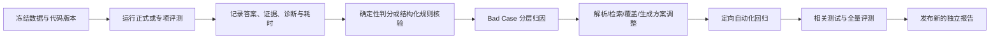

# 可信 RAG 银行业监管问答系统：评测方案与结果

## 1. 文档定位

本文档说明系统的 AI 效果如何被定义、执行、判分和复核，并汇总已经形成的公开评测结论。它关注检索、证据、回答、拒答和澄清质量，不替代产品功能验收。

原始监管资料、比赛 Manifest、题集、逐题报告、Bad Case 明细和来源哈希只保留在本地私有环境；公开仓库仅披露不能还原单题内容的评测方法、汇总指标和结论。

技术实现见[技术文档](技术文档.md)，产品整体交付检查见[验收方案](验收方案.md)。

## 2. 评测目标

评测回答五个问题：

1. 系统能否正确回答制度事实和统计表格问题；
2. 回答是否引用了正确来源，而不只是选对选项；
3. 数字、日期、机构、文号等关键实体是否保持准确；
4. 资料不足或条件不明确时，系统能否正确拒答或澄清；
5. 跨文件比较与计算是否取得完整操作数和完整证据。

## 3. 被评对象与快照边界

正式评测快照使用：

- 生成模型：`deepseek-v4-flash`；
- 向量模型：`BAAI/bge-large-zh-v1.5`；
- 重排模型：`BAAI/bge-reranker-base`；
- 检索：制度/表格向量通道、BM25、RRF、Reranker；
- 生成控制：目标级覆盖检查、一次受控补搜、证据约束生成和确定性计算。

冻结知识库 Manifest 含 500 份文件记录，其中 481 份进入解析和索引流程，形成 8,945 个制度/段落 Chunk 和 29,561 个表格 Chunk，共 38,506 个全局唯一 Chunk。

评测结果是指定数据、代码、模型和运行环境形成的历史快照。除非重新运行完整评测，否则后续代码修改不能自动继承同样的结果。

## 4. 评测集设计

### 4.1 正式选择题评测

正式评测的历史目标、执行边界和验收口径见 [#21](https://github.com/wxl-0/trusted-rag-banking/issues/21)。该 Issue 为开发完成后依据现有证据重建的历史规格。

原始评测集包含 300 道题：

| 来源 | 数量 |
| --- | ---: |
| Excel | 100 |
| Word | 100 |
| PDF | 100 |

题型包括：

- 单事实检索；
- 多事实检索；
- 表格取数；
- 表格比较；
- 表格计算。

其中 1 题无法唯一表达两个取数区块，标记为 `excluded_ambiguous`。正式统计使用其余 299 道非歧义题，排除规则在运行前固定，不因模型回答结果临时改变。

### 4.2 开放式专项评测

专项评测的历史设计规格见 [#22](https://github.com/wxl-0/trusted-rag-banking/issues/22)。它与正式评测相互独立，不改变正式题集和报告。

专项集包含 100 道开放式问题，用于补足选择题无法直接衡量的能力：

| 子集 | 数量 | 主要目标 |
| --- | ---: | --- |
| 关键实体题 | 50 | 核验数字、日期、机构名称、文号等实体 |
| 库外处理题 | 30 | 核验资料缺失、证据不足和条件不明时的行为 |
| 跨文件题 | 20 | 核验双 Excel 跨期比较、计算和证据完整性 |

库外处理题进一步分为：

- 知识库完全没有：10 道，应拒答；
- 现有证据不足：10 道，应拒答；
- 条件或口径不明确：10 道，应澄清。

### 4.3 Bad Case 回归集

回归资产的后续产品化与敏感边界由 [#16](https://github.com/wxl-0/trusted-rag-banking/issues/16) 跟踪。

本地私有环境独立维护 Bad Case 回归集，不修改正式 299 题和专项 100 题。当前文档快照记录 26 个案例，状态严格区分：

- `fixed`：存在修复提交和自动化测试；
- `snapshot_failed`：只证明历史报告快照中失败；
- `open`：当前已复现但尚未完成通用修复。

2026-08-29 的验证快照覆盖当时 24 个案例，不冒充已经验证后来新增案例。

## 5. 指标与判分规则

### 5.1 正式评测指标

| 指标 | 计算方法 | 当前结果 |
| --- | --- | ---: |
| 总体准确率 | 正确题数 / 299 道非歧义题 | 291/299，97.32% |
| 制度事实准确率 | 制度事实正确题数 / 对应题数 | 96.50% |
| 表格题准确率 | 表格题正确题数 / 对应题数 | 98.99% |
| 证据引用命中率 | 至少命中一个标准来源的题数 / 299 | 296/299，99.00% |

选择题使用确定性规则解析选项和判分，不使用 LLM Judge 替代正式分数。无法可靠提取选项时标记 `unparseable`，不随机猜测。

### 5.2 开放式专项指标

| 指标 | 判定方法 | 当前结果 |
| --- | --- | ---: |
| 总体准确率 | 满足对应题型金标准的题数 / 100 | 90/100，90.00% |
| 关键实体错误率 | 未命中实体数 / 金标准实体总数 | 6/122，4.92% |
| 库外处理正确率 | 正确拒答或澄清题数 / 30 | 28/30，93.33% |
| 应拒答正确率 | 正确拒答题数 / 20 | 20/20，100% |
| 应澄清正确率 | 正确澄清题数 / 10 | 8/10，80% |
| 跨文件回答准确率 | 正确回答题数 / 20 | 17/20，85.00% |
| 跨文件证据命中率 | 完整命中来源数 / 40 个预期来源 | 34/40，85.00% |
| 跨文件证据完整率 | 两个来源均完整命中的题数 / 20 | 17/20，85.00% |

跨文件证据只有在文件名、单元格、期间、指标和值均符合标注时才计为命中。

### 5.3 关键实体规则修订

初始评分器只提取阿拉伯数字，没有把“三年/3 年”“一个/1 个”等带相同单位的等价表达视为同一实体，同时误将部分问题主体标成回答必须重复输出的实体。

修订后：

- 增加小于 100 的整数中文表达和同单位联合匹配；
- 从金标准实体中移除问题主体；
- 保留原始回答、证据和延迟，不修改模型输出；
- 单独记录评分版本、重评分时间和原始报告哈希。

关键实体错误率由初始规则下的 10/123（8.13%）修订为 6/122（4.92%）。这是评分规则纠偏，不是重新生成答案。

## 6. 评测流程



每题至少保留以下诊断维度：

- 问题类型和问题分解方式；
- 检索目标及来源约束；
- 各路候选数量和阶段耗时；
- 目标覆盖状态；
- 是否执行补搜及补搜次数；
- 最终证据和拒答原因；
- 模型调用、重试和总耗时；
- 判分状态和失败层级。

## 7. Bad Case 归因框架

| 层级 | 典型问题 | 主要改进方向 |
| --- | --- | --- |
| 数据与解析 | 合并单元格、页码、行列口径或单位丢失 | Parser、Chunk 契约、定向更新 |
| 查询理解 | 指代对象、期间、指标或问题类型识别错误 | 上下文化改写、规则路由、澄清 |
| 检索 | 精确词漏召回、长 PDF 多事实分散、来源偏置 | BM25/向量、独立 RRF、标题约束 |
| 覆盖 | 只找到部分事实或少一个计算操作数 | 目标级覆盖、受控补搜 |
| 生成 | 实体漏答、单位换算、证据 ID 或数字不可核验 | 证据约束、后端校验、确定性计算 |
| 评测 | 等价表达未识别或题目本身歧义 | 评分规则版本化、歧义题排除 |

修复必须针对通用原因，并增加自动化回归；不得只为单题硬编码答案。

## 8. 结果汇总

### 8.1 正式评测

| 来源 | 正确/总数 | 准确率 |
| --- | ---: | ---: |
| Excel | 98/99 | 98.99% |
| Word | 99/100 | 99.00% |
| PDF | 94/100 | 94.00% |
| **总体** | **291/299** | **97.32%** |

| 题型 | 正确/总数 | 准确率 |
| --- | ---: | ---: |
| 表格取数 | 34/34 | 100% |
| 表格比较 | 33/33 | 100% |
| 表格计算 | 31/32 | 96.88% |
| 单事实检索 | 129/134 | 96.27% |
| 多事实检索 | 64/66 | 96.97% |

最终共有 8 道未答对，其中 5 道为题库内可回答问题的误拒答，3 道为选项判断错误。问题集中在 PDF 多事实覆盖、单事实召回和表格计算。

### 8.2 专项评测

| 子集 | 正确/总数 | 结果 |
| --- | ---: | ---: |
| 关键实体题 | 45/50 | 90.00% |
| 库外处理题 | 28/30 | 93.33% |
| 跨文件题 | 17/20 | 85.00% |
| **总体** | **90/100** | **90.00%** |

专项结果表明：资料完全缺失或证据不足时拒答稳定；条件不明确时仍有 2 题未正确澄清；跨文件剩余失败主要涉及报表显示精度、比例缩放和单位换算。

## 9. 延迟与资源记录

### 9.1 正式评测

- 299 道题完成后最终报告无执行错误；
- 总耗时均值 18.2 秒，中位数 15.7 秒，P95 38.8 秒；
- 检索阶段中位数 11.1 秒；
- 生成阶段中位数 3.3 秒；
- 报告记录 300 次模型 API 调用和 791,110 Token。

### 9.2 专项评测

- 覆盖 100/100 题，执行错误为 0；
- 平均耗时 7.4 秒，中位数 5.3 秒，P95 19.2 秒；
- 最大耗时 40.4 秒。

以上性能数据只代表形成报告时的机器、模型接口和索引状态，不能视为其他部署环境的固定性能承诺。

## 10. 质量门槛

后续影响解析、检索、生成或评测逻辑的修改，至少满足：

1. 对应单元和回归测试通过；
2. 已知 Bad Case 不发生无说明退化；
3. 评分口径变更必须版本化并保留原始报告；
4. 正式评测题目和答案不能为了提升结果被修改；
5. 证据和关键数字必须经过后端核验；
6. 若无法运行完整私有评测，应明确只完成了代码级或定向回归验证。

## 11. 复现入口

```bash
# 正式评测
uv run --frozen python scripts/run_eval.py --run-name <run-name>

# 运行指定题目
uv run --frozen python scripts/run_eval.py --ids Q001,Q002 --run-name <run-name>

# 开放式专项评测
uv run --locked python scripts/specialized_eval/run_eval.py \
  --run-name <run-name> --publish

# 对同一批实际回答离线重评分
uv run --locked python scripts/specialized_eval/rescore.py \
  --run-name <run-name> --publish

# 结构和回归资产测试
uv run --frozen python -m pytest \
  tests/test_eval_dataset.py \
  tests/test_eval_report.py \
  tests/test_eval_runner.py \
  tests/test_specialized_eval.py \
  tests/test_bad_case_regression_dataset.py -v
```

上述命令需要使用者自行准备合法数据和模型配置。公开仓库的空目录占位不能复现私有比赛报告。

## 12. 已知局限与后续评测

1. 条件澄清正确率为 80%，应继续扩充统计口径不明确场景；
2. 跨文件回答与证据命中率为 85%，应加强显示精度、比例缩放和单位换算测试；
3. 长 PDF 多事实分散时仍可能漏召回，应增加跨页、多条款覆盖评测；
4. 当前性能未在统一 CPU、内存和并发矩阵下测试；
5. 下一阶段应增加真实并发、长会话成本、在线入库后即时可检索和故障恢复的持续评测。
