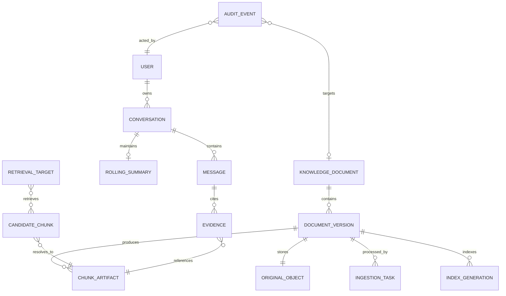
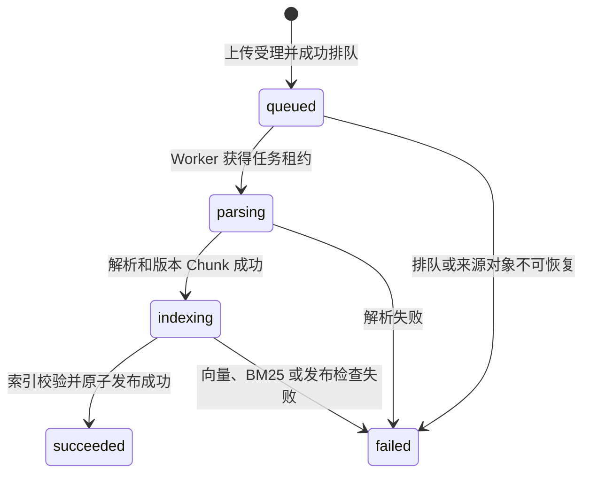
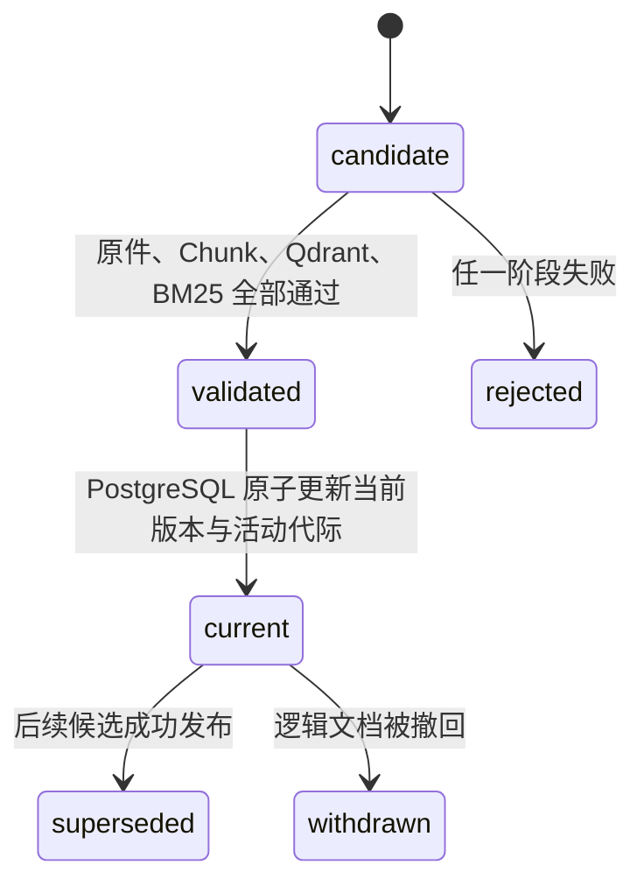
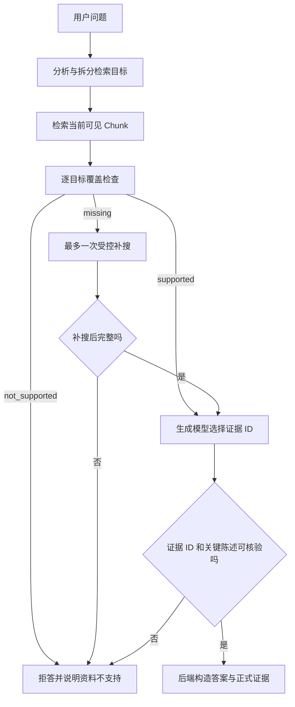

# 可信 RAG 银行业监管问答系统：领域模型

## 1. 文档定位

本文档描述系统中的业务对象、关系、生命周期和不可破坏的业务规则。它不等同于数据库 ER 图，也不展开 BM25、向量模型或 Reranker 的算法细节。

产品目标和功能范围见[产品需求说明](产品需求说明.md)，组件实现见[技术文档](技术文档.md)，重要架构取舍见 [`adr/`](adr/)。

## 2. 领域边界

系统采用单企业、单套企业共享知识库模型：

- 企业知识文档对所有已认证企业成员共享；
- 个人对话按用户隔离，不因维护者角色而共享；
- 知识库维护者负责资料维护，不负责 Keycloak 系统管理；
- 问答结论必须绑定当前可见知识版本中的证据；
- PostgreSQL 保存业务事实，外部存储和索引只保存各自负责的产物。

## 3. 子领域划分

| 子领域 | 主要职责 | 核心对象 |
| --- | --- | --- |
| 身份与访问 | 认证用户、解析业务角色、执行资源权限 | User、BusinessRole |
| 个人对话 | 保存个人问题、回答、证据和长对话摘要 | Conversation、Message、RollingSummary |
| 企业知识库 | 管理逻辑文档、不可变版本、原件和撤回状态 | KnowledgeDocument、DocumentVersion、OriginalObject |
| 入库与发布 | 管理异步任务、候选产物、活动版本和索引代际 | IngestionTask、ChunkArtifact、IndexGeneration |
| 可信问答 | 分析问题、检索候选、检查覆盖并生成有据回答 | Question、RetrievalTarget、CandidateChunk、Evidence、Answer |
| 审计与诊断 | 记录重要业务操作及安全结果 | AuditEvent、RequestId |

## 4. 核心术语

| 术语 | 定义 |
| --- | --- |
| 企业成员 | 经 Keycloak 认证并拥有 `member` 业务角色的用户 |
| 知识库维护者 | 拥有 `knowledge_maintainer` 角色、可维护企业共享资料的企业成员 |
| 知识文档 | 面向业务用户展示和管理的逻辑文档，不等同于某次上传的文件版本 |
| 文档版本 | 一次上传形成的不可变处理单元，关联原件、Chunk 和索引候选 |
| 入库任务 | 推动一个文档版本完成解析、索引和发布的异步业务任务 |
| 当前版本 | 已通过全部检查、允许参与问答检索的唯一文档版本 |
| BM25 代际 | 一份不可变关键词索引产物，由 PostgreSQL 活动指针选择 |
| Chunk | 解析、索引、检索和证据引用之间的统一信息单元 |
| 检索目标 | 从用户问题中拆出的一个需要独立取得证据的事实或操作数 |
| 证据 | 后端从本次候选 Chunk 中选取并返回给用户核验的来源记录 |
| 拒答 | 资料缺失、证据不足或无法核验时，不输出未经支持的结论 |
| 澄清 | 问题条件、对象、期间或统计口径不唯一时，要求用户补充信息 |

## 5. 聚合与对象

### 5.1 用户与个人对话聚合

**User**

- 由 Keycloak 主体标识映射；
- 拥有一个或多个业务角色；
- 可以拥有多个 Conversation；
- 不在业务数据库中保存密码。

**Conversation**

- 是个人会话的聚合根；
- 只属于一个用户；
- 包含标题、活动时间和逻辑删除状态；
- 管理 Message 和 RollingSummary 的一致性边界。

**Message**

- 属于一个 Conversation；
- 保存用户问题或系统回答；
- 完成回答同时保存正式 Evidence 元数据；
- 使用请求 ID 保证同一轮重试不会重复持久化。

**RollingSummary**

- 是模型上下文产物，不替代原始 Message；
- 当近期历史超过预算时刷新；
- 只参与当前 Conversation 的模型输入装配。

### 5.2 企业知识文档聚合

**KnowledgeDocument**

- 是知识库管理页面中的逻辑对象；
- 记录文件名、展示元数据、当前版本和撤回状态；
- 可以关联多个 DocumentVersion；
- 逻辑撤回后立即退出列表有效集、下载入口和后续检索。

**DocumentVersion**

- 每次上传创建一个不可变版本；
- 关联一个私有 OriginalObject；
- 关联版本范围内的 ChunkArtifact、Qdrant 点和候选 BM25 代际；
- 处理成功不自动等同于发布，必须完成发布一致性检查。

**OriginalObject**

- 保存于 MinIO 私有 Bucket；
- PostgreSQL 只记录对象标识、校验和和业务元数据；
- 下载由后端鉴权后流式返回，前端不获得存储凭据和对象地址。

### 5.3 入库任务与发布聚合

**IngestionTask**

- 以稳定任务 UUID 作为幂等键；
- 记录状态、阶段时间、租约和安全结果；
- 重复投递、Worker 重启和过期恢复仍推进同一个版本；
- 失败时保留可诊断结果，但不发布半成品。

**ChunkArtifact**

- 是某一 DocumentVersion 的不可变解析产物；
- 保留来源、章节、页码、工作表、单元格、期间和单位等可追溯元数据；
- 供 Qdrant、BM25、检索和 Evidence 共用。

**IndexGeneration**

- Qdrant 点通过文档和版本标识区分候选与当前版本；
- BM25 以不可变代际文件构建；
- PostgreSQL 同时选择当前 DocumentVersion 和活动 BM25Generation；
- Redis 锁只负责短期协调，不决定最终业务事实。

### 5.4 可信问答对象

**Question**

- 包含当前用户输入及当前 Conversation 上下文；
- 根据规则或模型识别制度、表格、比较、计算和混合类型。

**RetrievalTarget**

- 表示一个待取得证据的事实、比较对象或计算操作数；
- 携带来源提示、期间、指标、单位、结构位置和覆盖词；
- 覆盖状态为 `supported`、`not_supported` 或 `missing`。

**CandidateChunk**

- 来自当前可见版本的 BM25 或向量通道；
- 经 RRF 合并、去重和 Reranker 排序；
- 是生成模型可以选择证据 ID 的封闭候选集合。

**Evidence**

- 只能引用本次 CandidateChunk；
- 正式内容由后端按证据 ID 重建；
- 制度证据侧重文件、章节、页码和原文；
- 表格证据侧重工作表、行列口径、期间、单位、单元格和值。

**Answer**

- 包含自然语言答案、Evidence、可选拒答原因和耗时；
- 数值、比例和日期必须能从所选证据核验；
- 计算结论必须由已取得的全部操作数确定性生成。

## 6. 对象关系

这张图表达业务关系，不要求与每一张物理数据库表一一对应。

## 7. 生命周期

### 7.1 入库任务状态机

前端将 `queued`、`parsing` 和 `indexing` 统一显示为“进行中”，但后端保留真实阶段用于恢复和诊断。

### 7.2 文档版本发布

候选版本在 `candidate` 和 `validated` 阶段都不能被普通检索读取。发布失败时旧 `current` 版本保持可用。

### 7.3 问答决策

## 8. 核心业务不变量

1. 一个 KnowledgeDocument 可以有多个 DocumentVersion，但最多只有一个当前有效版本。
2. 只有 PostgreSQL 当前版本集合允许的 Chunk 才能参与检索。
3. 当前文档版本和活动 BM25 代际必须在同一发布决策中更新。
4. 候选版本处理失败不能改变旧版本和旧 BM25 代际的可用性。
5. 重复任务投递不能创建重复版本、重复活动代际或多个终态任务。
6. 文档逻辑撤回后必须立即退出后续检索和下载入口。
7. 企业成员只能读取和修改自己的 Conversation；维护者也不例外。
8. 知识库管理权限必须由后端角色校验，不能依赖前端隐藏按钮。
9. Answer 中的 Evidence 只能来自本次 CandidateChunk，模型不能自行填写来源正文。
10. 计算题缺少任一操作数、期间、单位或口径时不得计算。
11. PostgreSQL 是业务事实来源；Redis、MinIO、Qdrant 和 BM25 不得各自决定业务状态。
12. 公开仓库不保存真实凭据、私有原始资料、Chunk、索引和可还原单题的评测明细。

## 9. 领域对象与组件映射

| 领域对象 | 事实或产物所在组件 | 主要代码 |
| --- | --- | --- |
| User、BusinessRole | Keycloak；PostgreSQL 仅保存业务引用 | `src/auth.py` |
| Conversation、Message、RollingSummary | PostgreSQL | `src/conversations.py`、`src/context_control.py` |
| KnowledgeDocument、DocumentVersion、IngestionTask | PostgreSQL | `src/knowledge_documents.py`、`src/document_uploads.py` |
| OriginalObject | MinIO | `src/document_uploads.py` |
| ChunkArtifact | MinIO 版本对象及处理内存对象 | `src/parser/`、`src/ingestion_worker.py` |
| Qdrant 候选点 | Qdrant | `src/indexer/qdrant_index.py` |
| BM25Generation | 文件产物；活动指针在 PostgreSQL | `src/indexer/bm25_index.py`、`src/index_activation.py` |
| RetrievalTarget、CandidateChunk | 单次问答执行上下文 | `src/retriever/`、`src/generator/decomposer.py` |
| Answer、Evidence | API 响应；完成消息证据保存在 PostgreSQL | `src/generator/answer_builder.py`、`src/api/` |
| AuditEvent | PostgreSQL | `src/document_uploads.py`、`src/knowledge_documents.py` |

## 10. 模型演进边界

新增实体、状态或业务角色前，应先检查是否破坏上述不变量。以下变化需要单独规格或 ADR：

- 从单企业扩展为多租户；
- 引入个人知识库或团队知识库层级；
- 提供同名替换上传、版本浏览和业务回滚；
- 增加维护者手工重试或永久物理清理；
- 改变 PostgreSQL 业务事实来源；
- 允许模型生成候选集合之外的证据；
- 改变当前版本和 BM25 活动代际的一致性语义。
